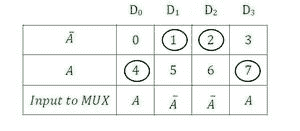
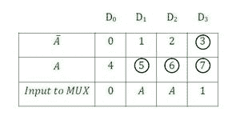
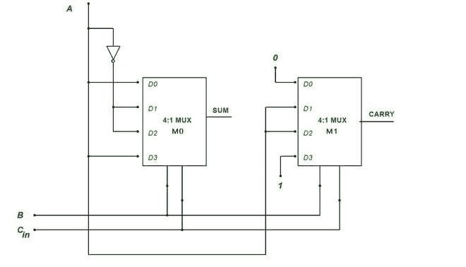

# 使用多路复用器的 1 位全加器

> 原文:[https://www . geesforgeks . org/1 位全加器使用多路复用器/](https://www.geeksforgeeks.org/1-bit-full-adder-using-multiplexer/)

**先决条件:** [多路复用器](https://www.geeksforgeeks.org/multiplexers-in-digital-logic/)[全加器](https://www.geeksforgeeks.org/full-adder-in-digital-logic/)

**简介:**
[多路复用器](https://www.geeksforgeeks.org/multiplexers-in-digital-logic/)和[全加器](https://www.geeksforgeeks.org/full-adder-in-digital-logic/)是两种不同的数字逻辑电路。多路复用器是一个数字开关。它允许来自多个来源的数字信息被路由到一条输出线上。另一方面，全加器电路执行三位相加，并产生和与进位作为输出。我们的目标是使用多路复用器而不是通常的基本逻辑门来构建全加器电路。

**步骤 1–**要使用 MUX 实现全加器，我们需要首先创建全加器的真值表。

*   **全加器真值表–**

<figure class="table">

| 输入 | 输出 |
| A | B | C-In | 总和 | 出 |
| Zero | Zero | Zero | Zero | Zero |
| Zero | Zero | one | one | Zero |
| Zero | one | Zero | one | Zero |
| Zero | one | one | Zero | one |
| one | Zero | Zero | one | Zero |
| one | Zero | one | Zero | one |
| one | one | Zero | Zero | one |
| one | one | one | one | one |

</figure>

**步骤 2–**我们需要从真值表中找出求和进位输出的最小值。

```
For Sum -     f ( A, B, C-In) = Σ ( 1,2,4,7 )
For Carry: - f ( A, B, C-In) = Σ ( 3,5,6,7 )
```

**步骤 3–**现在我们需要求和和进位的等式。为了找到答案，我们将创建求和进位输出的设计表。

**注意:**为了理解下一部分，建议通过 [**使用多路复用器**](https://www.geeksforgeeks.org/implementation-of-sop-function-using-multiplexer/) 实现 SOP 功能

**总输出设计表:**



总和设计表

对于求和分位数(1，2，4，7)，输出为高，因此在设计表中用圆圈标出。

*   对于 D <sub>0</sub> 只有 4 为高，对应于表中的 A，因此多路复用器(M0)的 D <sub>0</sub> 输入将为 A
*   其他输入也遵循同样的规则–D<sub>1</sub>= A’，D<sub>2</sub>= A’，D <sub>3</sub> =A。

**进位输出设计表:**



进位设计表

对于进位(3，5，6，7)，输出为高，因此它们在设计表中被圈起来，就像 sum 的设计表一样。

*   这里，对于 D <sub>0</sub> 输入 0 和 4，两者都为低，因此多路复用器的输入将为 0
*   对于 D <sub>3</sub> ，3 和 7 都为高电平，因此多路复用器的输入为 1。
*   D <sub>1</sub> 和 D <sub>2</sub> 将沿用之前的规则，为 D <sub>1</sub> =A 和 D <sub>2</sub> =A

现在，我们已经将所有输入信息输入到多路复用器，因此我们可以设计逻辑电路。

**逻辑电路:**



**说明:**

**输入–**
M0 多路复用器的输入按照 SUM 的设计表，即 D <sub>0</sub> = A，D<sub>1</sub>= A’，D<sub>2</sub>= A’，D<sub>3</sub>= A
M1 多路复用器的输入按照 CARRY 的设计表，即 D <sub>0</sub> = 0，D <sub>1</sub> = A，D 【T16 d<sub>3</sub>= 1
M0 和 M1 的选择线均与 B & Cin 输入相连。

**输出–**
**M0**多路复用器的输出将具有 SUM 作为输出， **M1** 多路复用器将具有 CARRY 作为输出。

**应用:**
这个电路是全加器电路，所以会有全加器电路的所有应用。以下列表–

1.  片上库的基本构件。
2.  在处理器和其他类型的计算设备中，算术逻辑单元使用加法器。