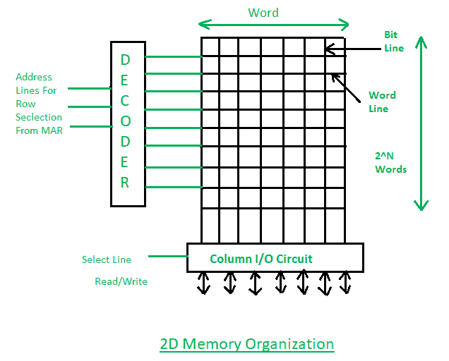
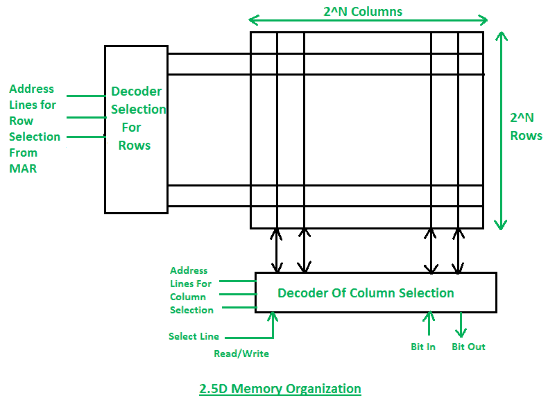

# 2D 和 2.5D 记忆组织

> 原文:[https://www . geesforgeks . org/2d-and-2-5d-内存-组织/](https://www.geeksforgeeks.org/2d-and-2-5d-memory-organization/)

随机存取存储器或只读存储器的内部结构由包含一个存储位的存储单元组成。一组 8 位构成一个字节。内存是由行和列组成的多维数组。其中，每个单元存储一位，一整行包含一个字。一段记忆可以简单地分为以下几种形式。

```
2n = N
```

其中，N 是地址线的数量，N 是以字节为单位的总内存。
会有 2 <sup>n</sup> 个字。

**2D 记忆组织–**
在 2D 组织中，记忆以行和列(矩阵)的形式划分。每行包含一个字，现在在这个内存组织中，有一个解码器。解码器是包含 n 条输入线和 2 条 <sup>n 条</sup>输出线的组合电路。输出线之一通过包含在 MAR 中的地址选择该行，并且由该行表示的字被选择并且通过数据线被读取或写入。



**2.5D 内存组织–**
在 2.5D 组织中，场景是相同的，但是我们有两个不同的解码器，一个是列解码器，另一个是行解码器。列解码器用于选择列，行解码器用于选择行。来自 MAR 的地址作为解码器的输入。解码器将通过位轮廓选择相应的单元，然后来自该位置的数据将被读取，或者通过行中的位，数据将被写入该存储位置。



**读写操作–**

1.  如果选择线处于读取模式，则由标记代表的字/位将可用于数据线并被读取。
2.  如果选择线处于写模式，则来自存储器数据寄存器的数据将被发送到由存储器地址寄存器寻址的相应单元。
3.  借助选择线，我们可以选择所需的数据，并对其执行读写操作。

**2D&2.5D 机构对比–**

1.  在 2D，组织硬件是固定的，但在 2.5D 中，硬件会发生变化。
2.  2D 组织要求更多数量的门，而 2.5D 要求更少。
3.  与 2.5D 组织相比，2D 更复杂。
4.  在 2D 组织中，纠错是不可能的，但在 2.5D 中，它可以很容易地完成。
5.  2D is more difficult to fabricate in comparison to the 2.5D organization.