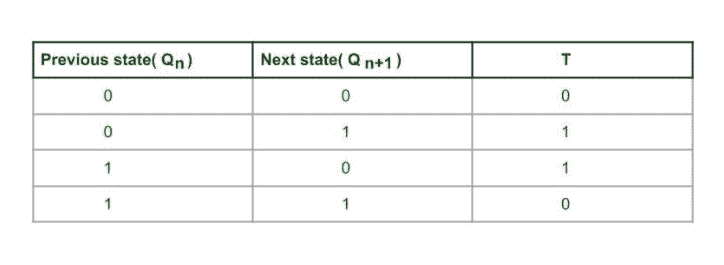
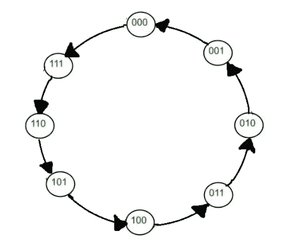
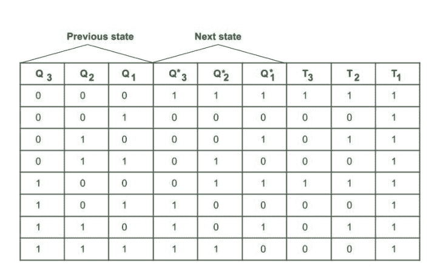
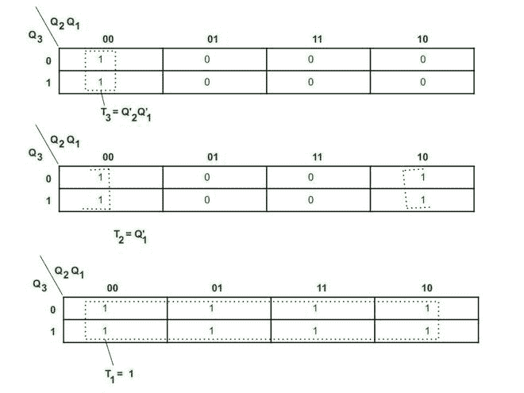
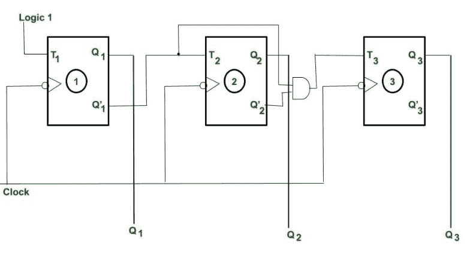
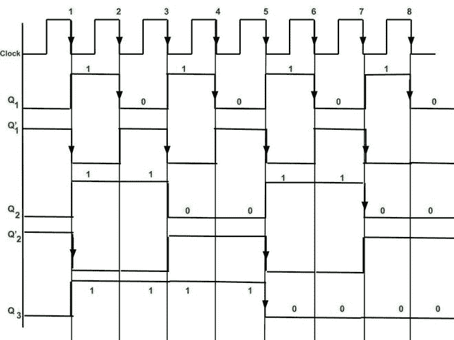
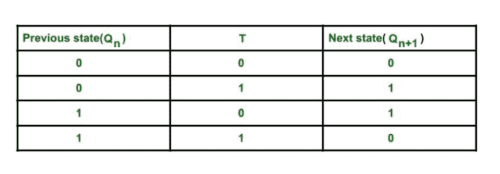

# 3 位同步递减计数器

> 原文:[https://www . geesforgeks . org/3 位同步递减计数器/](https://www.geeksforgeeks.org/3-bit-synchronous-down-counter/)

**先决条件** : [计数器](https://www.geeksforgeeks.org/counters-in-digital-logic/)、[同步计数器](https://www.geeksforgeeks.org/ripple-counter-in-digital-logic/)。

**3 位同步递减计数器:**

*   同步计数器同时向所有触发器提供时钟。
*   随着状态数的增加，电路变得复杂。
*   速度很高。

**设计**:设计涉及的步骤有

**1。决定触发器的数量–**

```
N number of Flip flop(FF) required for N bit counter.
```

*   对于 3 位计数器，我们需要 3 FF。
*   **最大计数** = 2 <sup>n</sup> -1，其中 n 是位数。
*   对于 n= 3，最大计数= 7。
*   这里用的是 T FF。

**2。编写 FF 的激励表–**



**3。绘制状态图和电路励磁表–**
**状态数= 2 <sup>n，</sup>其中 n 为位数。**

** **

**这里 T = 1，则有输出状态(下一个状态从前一个状态改变)改变，即 Q 从 0 变为 1 或 1 变为 0
T= 0 则没有状态输出状态改变，即 Q 保持不变**

****4。使用 k 图找到简化方程–****

**

**3 位同步递减计数器的 K 图**** 

****5。创建电路图-**
时钟在同一时刻提供给每个触发器。
根据 K 图的简化方程，将触发(T)输入提供给每个触发器。**

****

**

**3 位同步递减计数器时序图。**** 

****说明** :
此处五边沿触发时钟用于触发。**

****

**正如我们从特性表中看到的，当 T = 1 时，发生切换，当 T =0 时，存储输出状态。**

*   **最初 Q <sub>3</sub> = 0，Q <sub>2</sub> = 0，Q <sub>1</sub> = 0。**
*   **在 K 图的简化方程中，我们得到 T <sub>1</sub> = 1，因此触发器 1 输出 Q <sub>1</sub> 在每个负沿被触发(因为时钟是负沿触发的)。触发器(FF) 2 触发输入(T2)连接到 Q' <sub>1。</sub>因此，触发器 2 输出状态 Q <sub>2</sub> 只有在有时钟下降沿(即 ve 沿触发)且 Q’<sub>1</sub>= 1 时才被触发。**
*   **类似地，触发器 3 的触发输入(T)连接到 Q’2 和 Q’1。因此，当存在时钟下降沿且 Q’2 = 1 且 Q’1 = 1 时，触发器 3 的输出被触发。(从时序图中可以看出)**
*   **因此，在第 8 个 ve 边沿触发时钟后，我们得到输出(随着 Q3(MSB) Q2 Q1(LSB)递减计数)，三个触发器的输出再次变为 Q3 = 0，Q2 = 0，Q1 =0。**
*   **我们在每隔一个边沿时钟脉冲后获得输出(状态变化)。**
*   **通过 3 触发器，我们得到输出为 2 <sup>3</sup> -1= 7 到 0。**