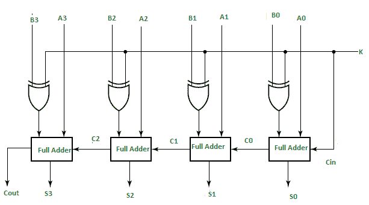

# 4 位二进制加减器

> 原文:[https://www . geesforgeks . org/4 位二进制加减器/](https://www.geeksforgeeks.org/4-bit-binary-adder-subtractor/)

在数字电路中，**二进制加减器**是一种既能在一个电路中对二进制数进行加法运算又能进行减法运算的装置。正在执行的操作取决于控制信号保持的二进制值。它是算术逻辑单元的组成部分之一。

这个电路需要 Exor 门，二进制加减法，全加器的先决知识。

让我们考虑两个 4 位二进制数 A 和 B 作为数字电路的输入，以进行数字运算

```
A0 A1 A2 A3 for A
B0 B1 B2 B3 for B 
```

该电路由 4 个全加器组成，因为我们对 4 位数字进行运算。有一条控制线 K，它保存一个 0 或 1 的二进制值，确定正在执行的操作是加法还是减法。



如图所示，第一个全加器有控制线直接作为输入(输入进位 Cin)，输入 A0(A 的最低有效位)直接输入全加器。第三个输入是 B0 和 K 的异或。产生的两个输出是和/差(S0)和进位(C0)。

如果 K(控制线)的值为 1，B0(异或)K 的输出= B0′(补码 B0)。因此，操作将是 A+(B0′)。现在两个数字 A 和 B 的 2 的补数减法由 A+B’给出。这表明当 K=1 时，对四个比特数执行的操作是减法。

同样，如果 K=0，B0(异或)K=B0。操作是简单的二进制加法 A+B。这表明当 K=0 时，对四个比特数执行的操作是加法。

然后，C0 被串行传递到第二个全加器，作为其输出之一。和/差 S0 被记录为和/差的最低有效位。A1、A2、A3 是第二、第三和第四全加器的直接输入。然后第三个输入是 B1、B2、B3 分别用 K 异或到第二、第三和第四全加器。进位 C1、C2 作为输入之一串行传递给连续全加器。C3 成为总和/差额的总进位。记录 S1、S2、S3 与 S0 形成结果。

对于 n 位二进制加减器，我们使用 n 个全加器。

**示例:**
让我们取两个 3 位数字 A=010 和 B=011，并将它们与控制线的两个值一起输入全加器。

```
For K=0:
B0(exor)K=B0 and C0=K=0

Thus from first full adder
= A0+B0
= 0+1
= 1, 

S0=1
C1=0
Similarly, 
S1=0 with C2=1
S2=1 and C2=0

Thus, 
A = 010 =2   
B = 011 = 3
Sum = 0101 = 5

For K=1
B0(exor)K=B0' and C0=k=1

Thus 
S0=1 and C1=0
Similarly 
S1=1 and C2=0
S2=1 and c3=0

Thus,  
A = 010 = 2
B = 011 = 3 
Sum(Difference) = 1111 = -1 
```