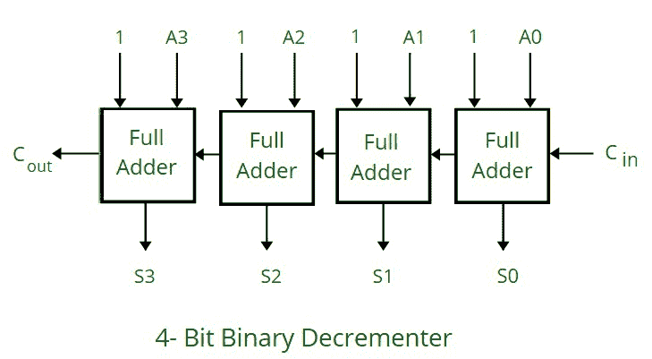
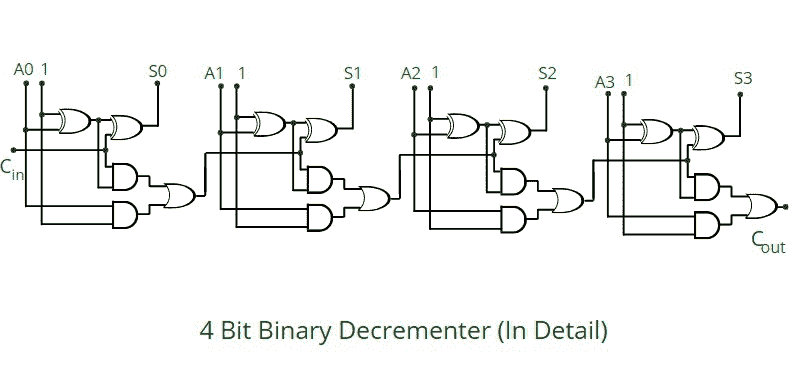

# 4 位二进制递减器

> 原文:[https://www.geeksforgeeks.org/4-bit-binary-decrementer/](https://www.geeksforgeeks.org/4-bit-binary-decrementer/)

**什么是 4 位二进制递减器？**
它从寄存器中存储的现有二进制值中减去 1 个二进制值，或者换句话说，我们可以简单地说，它将寄存器中存储的现有值减少 1。
对于任何 n 位二进制递减器，“n”是指需要递减 1 的寄存器的存储容量。所以我们需要 n 个全加器。因此，在 4 位二进制递减器的情况下，我们需要 4 个全加器。



**工作:**

*   它由 4 个全加器组成，一个接一个地连接。每个全加器有 3 个输入(进位输入，1，A)和 2 个输出(进位输出和 S)
*   一个 [<u>全加器</u>](https://www.geeksforgeeks.org/full-adder-in-digital-logic/#:~:text=Full%20Adder%20is%20the%20adder,as%20S%20which%20is%20SUM.) 基本由 2 个半加器和一个或门组成。
*   来自前一个全加器的进位(C)被传播到下一个全加器。因此，一个全加器的进位输出成为下一个全加器的三个输入之一。
*   它遵循二进制补码的概念，因此从上图中可以看出，我们将所有 4 个全加器中的 1 作为输入。
*   所以我们加 1111 来减 1。



**增加 1111 的原因:**

*   这是因为我们的主要动机是减去 1，在 4 位表示中是 0001
*   用 1 的补码表示它会得到:1110
*   用 2 的补码表示它(将 1 加 1 的补码)将给出:1111
*   这就是为什么输入 1111 在 4 位二进制递减器中获得递减输出的原因。

```
    In 4 bit representation           In 1's complement           In 2's complement   
 1 -------------------------> 0001 ----------------------> 1110 ---------------------> 1111

```


**示例:**

```
(Refer to the circuit diagram from right to left for better understanding)

1\. Input: 1010  ----> After using 4 bit binary decrementer ----> Output: 1001

  ***1 0 1 0       (Comparing from the circuit 1 0 1 0 is A3, A2, A1, A0 respectively)***
***+ 1 1 1 1       (1 1 1 1 is added as seen in the diagram also, in each full adder 1 is taken as input)***
 ***________***
 ***1 0 1 1       ( 1 0 1 1 , in the diagram are S3, S2, S1, S0 respectively)***
 ***________***

```

```
2\. Input: 0010  ----> After using 4 bit binary decrementer ----> Output: 0001

  ***1 0 1 0*** 
 ***+ 1 1 1 1***
 ***________***
 ***0 0 0 1***
 ***________***

```

```
3\. Input: 0011  ----> After using 4 bit binary decrementer ----> Output: 0001

 * ** 0 0 1 1***
 ***+ 1 1 1 1***
 ***_________***
 ***0 0 1 0***
 ***_________***

```