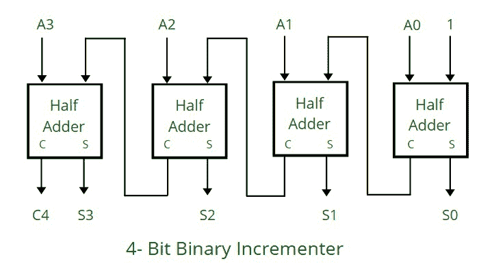
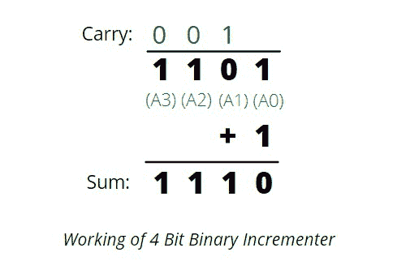

# 4 位二进制增量器

> 原文:[https://www.geeksforgeeks.org/4-bit-binary-incrementer/](https://www.geeksforgeeks.org/4-bit-binary-incrementer/)

**什么是 4 位二进制增量器？**
它将寄存器中存储的现有二进制值加 1，或者换句话说，我们可以简单地说，它将寄存器中存储的值增加 1。
对于任何 n 位二进制增量器，“n”是指需要增加 1 的寄存器的存储容量。所以我们需要 n 个半加法器。因此，在 4 位二进制增量器的情况下，我们需要 4 个半加法器。



**工作:**

*   半加法器一个接一个地连接，因为它有 2 个输入和 2 个输出，所以对于 LSB(最低有效位)半加法器或最右边的半加法器，给定 1 作为直接输入(第一输入)，A0 是寄存器的第一位(第二输入)，因此我们得到两个输出:和(S0)和进位(C)。
*   来自上一个半加法器的进位(C)被传播到下一个半加法器，因此上一个半加法器的进位输出成为下一个高阶半加法器的输入。
*   因此，考虑到 4 个半加法器的情况，电路总共得到 4 位(A0，A1，A2，A3)，1 相加，我们得到一个递增的输出。

 

**示例:**

```
(Refer to the circuit diagram from right to left for better understanding)

1\. Input: 1010 ----> After using 4 bit binary incrementer ----> Output: 1011

    ***1 0 1 0       (Comparing from the circuit 1 0 1 0 is A3, A2, A1, A0 respectively)***
 *** + 1       (1 is added as seen in the diagram also, in the first half adder, 1 is taken as input)***
 ***_________***
 *** 1 0 1 1       ( 1 0 1 1 , in the diagram are S3, S2, S1, S0 respectively)***
 ***_________***
```

```
2\. Input: 0010  ---> After using 4 bit binary incrementer ----> Output: 0011

 ***0 0 1 0***
 ***+ 1***
 ***_________***
 ***0 0 1 1***
 ***_________***
```

```
3\. Input: 0011  ---> After using 4 bit binary incrementer ----> Output: 0100

 ***0 0 1 1***
 ***+ 1***
 ***________***
 ***0 1 0 0***
 ***_________***
```