# 数字逻辑中的 5 变量 K 图

> 原文:[https://www . geeksforgeeks . org/5-数字逻辑中的变量-k-map/](https://www.geeksforgeeks.org/5-variable-k-map-in-digital-logic/)

先决条件–[K-Map 中的隐含](https://www.geeksforgeeks.org/digital-logic-implicants-k-map/)
**[卡诺图](https://www.geeksforgeeks.org/k-mapkarnaugh-map/)** 或 K-Map 是编写真值表的替代方法，用于布尔表达式的简化。至此我们熟悉了 3 变量 K-Map & 4 变量 K-Map。现在，让我们详细讨论一下 5 变量 K-Map。

任何包含 5 个变量的布尔表达式或函数都可以用 5 变量 K-Map 求解。这样一个 5 变量 K-Map 必须包含 **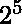 = 32 个单元格**。让 5 变量布尔函数表示为:
**f ( P Q R S T)** 其中 P、Q、R、S、T 为变量，P 为最高有效位变量，T 为最低有效位变量。

标准操作程序表达式的这种 K 图的结构如下所示:

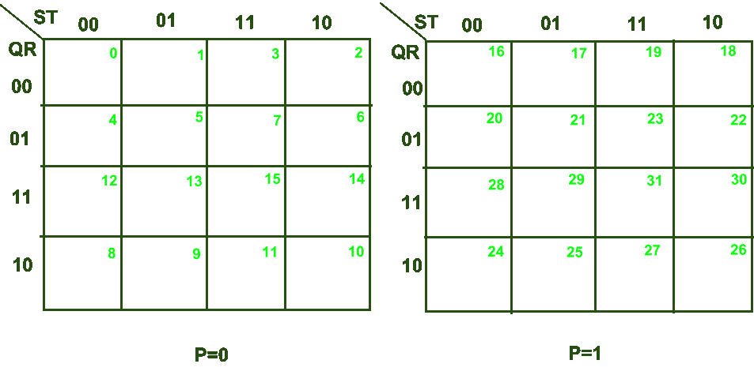

从这里描述的例子可以理解每个单元对应的单元号:
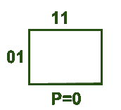

这里对于变量 **P=0，我们有 Q = 0，R = 1，S = 1，T = 1 即(PQRST)=(00111)** 。在十进制形式中，这相当于 **7** 。因此，对于上面显示的单元格，对应的单元格编号= 7。以类似的方式，我们可以写出对应于每个单元格的单元格号，如上图所示。
现在让我们讨论如何使用 5 变量 K-Map 来最小化布尔函数。

<u>***需遵守的规则:***</u>

1.  如果一个函数以紧致规范 SOP(乘积和)的形式给出，那么我们在相应的单元号中写下对应于每个小项(问题中提供)的**“1”**。例如:
    对于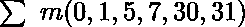，我们将写“1”对应单元号(0，1，5，7，30 和 31)。
2.  如果一个函数是以紧规范 POS(和的乘积)形式给出的，那么我们在相应的单元号中写下**“0”**对应于每个最大项(问题中提供的)。例如:
    对于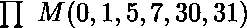，我们将写“0”对应单元号(0，1，5，7，30 和 31)。

<u>***应遵循的步骤:***</u>

1.  在标准操作程序的情况下，制作尽可能大的子多维数据集，覆盖所有标记为 1 的子多维数据集，或者在位置图的情况下，覆盖所有标记为 0 的子多维数据集。需要注意的是，每个子多维数据集只能包含 2 的幂项。此外，当且仅当在每个单元格的子多维数据集中，我们满足“m”个单元格是“T1”个相邻单元格“T2”时，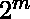个单元格的子多维数据集中也是可能的。
2.  所有*本质素隐含*必须出现在最小表达式中。

**一、求解 SOP 函数–**
为了清楚理解，我们用下面的表达式求解 5 变量 K-Map 的 SOP 函数最小化的例子:
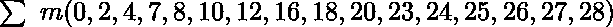

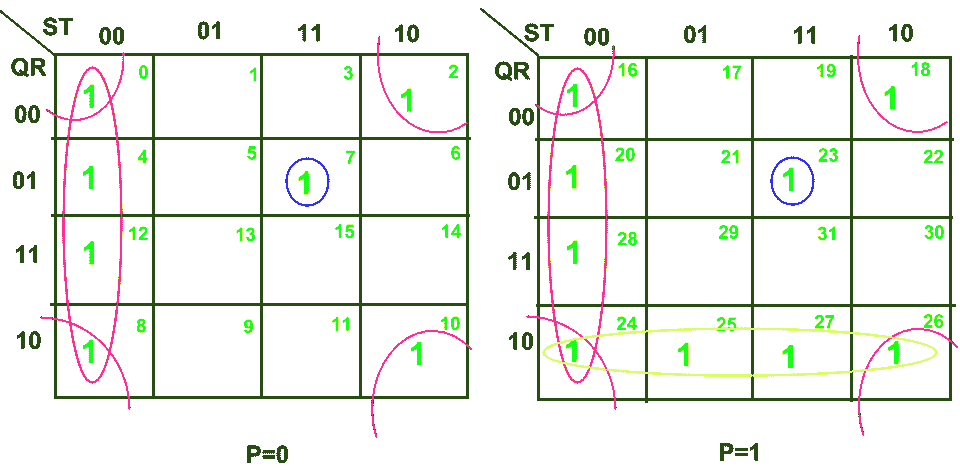

在上面的 K 图中，我们有 4 个子立方体:

*   **<u>子多维数据集 1:</u>** 用红色标记的子多维数据集由单元格(0、4、8、12、16、20、24、28)组成
*   **<u>子代 2:</u>** 蓝色标记的子代由细胞(7，23)组成
*   **<u>子代 3:</u>** 标记为粉红色的子代由细胞(0、2、8、10、16、18、24、26)组成
*   **<u>子代 4:</u>** 黄色标记的子代包括细胞(24、25、26、27)

现在，在编写每个子多维数据集中的最小表达式时，我们将搜索该子多维数据集中所有单元格所共有的文字。

*   **<u>子多维数据集 1</u> :** 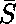 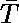
*   **<u>子多维数据集 2</u> :** 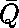 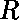  
*   **<u>子多维数据集 3</u> :** 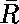 
*   **<u>子多维数据集 4</u> :** 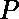 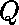 

最后给定布尔函数的最小表达式可以表示如下:
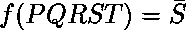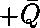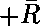

**二。求解 POS 函数–**
现在，让我们使用以下表达式求解 5 变量 K-Map 的 POS 函数最小化示例:
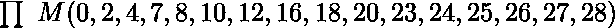

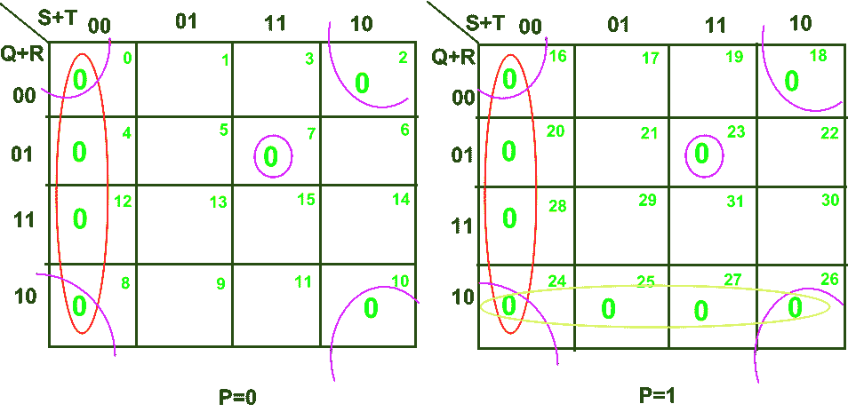

在上面的 K 图中，我们有 4 个子立方体:

*   **<u>子多维数据集 1:</u>** 用红色标记的子多维数据集由单元格(0、4、8、12、16、20、24、28)组成
*   **<u>子代 2:</u>** 蓝色标记的子代由细胞(7，23)组成
*   **<u>子代 3:</u>** 标记为粉红色的子代由细胞(0、2、8、10、16、18、24、26)组成
*   **<u>子代 4:</u>** 黄色标记的子代包括细胞(24、25、26、27)

现在，在编写每个子多维数据集中的最小表达式时，我们将搜索该子多维数据集中所有单元格所共有的文字。

*   **<u>子多维数据集 1</u>:**T4】
*   **<u>子多维数据集 2</u> :** 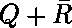 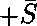 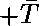
*   **<u>子多维数据集 3</u>:**T4】
*   **<u>子多维数据集 4</u> :** 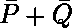 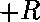

最后，给定布尔函数的最小表达式可以表示如下:
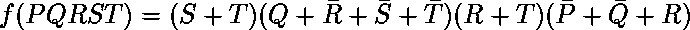

**<u>注</u> :**

1.  对于 5 变量 K-Map，单元格编号的范围将从 0 到 -1，即 0 到 31。
2.  上述术语*“相邻细胞”*是指“仅在一个变量上不同的任何两个细胞”。