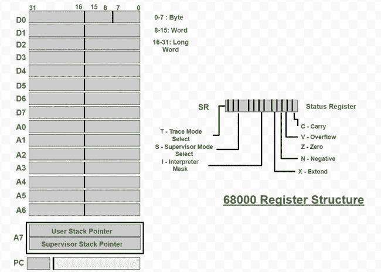
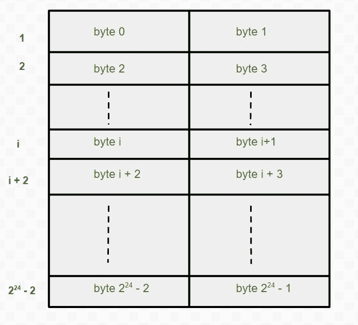

# 68000 家族寄存器和计算机体系结构中的寻址

> 原文:[https://www . geesforgeks . org/68000-计算机体系结构中的系列寄存器和寻址/](https://www.geeksforgeeks.org/68000-family-registers-and-addressing-in-computer-architecture/)

68000 处理器的特点是 16 位外部字长，因为处理器芯片有 16 个数据引脚用于连接存储器。然而，数据是在处理器内部包含 32 位的寄存器中处理的。该系列的其他型号有 68020、68030 和 68040 处理器。，均采用大型芯片封装，并具有 32 位外部数据引脚。因此，它们可以处理内部和外部的 32 位数据。

**68000 寄存器结构:**
68000 寄存器结构，有 8 个数据寄存器和 8 个地址寄存器，每个 32 位长。数据寄存器作为计数器充当通用累加器。下面给出了相同的结构。



68000 指令处理三种不同长度的操作数。据说 32 位操作数占用**长字**，16 位操作数构成**字**，8 位操作数为**字节**。当指令在寄存器中使用字节或字操作数时，操作数位于寄存器的低位。在大多数情况下，此类指令不会影响寄存器的剩余高阶位，但有些指令会将较短操作数的符号扩展到高阶位。

地址寄存器保存用于确定存储器操作数地址的信息。该信息可以是长单词或单词大小。当一个给定存储单元的地址是一个地址寄存器时，它充当指向该位置的指针。地址和数据寄存器都可以用作索引寄存器。一个地址寄存器 A7 具有作为处理器堆栈指针的特殊功能。地址寄存器和地址计算涉及 32 位。然而，在 68000 的情况下，只有地址的最低有效 24 位用于外部访问存储器。68020、68030、68040 处理器有 32 条外部地址线和 32 条数据线。



**称呼:**

*   68000 计算机的内存由 16 位字组成，并且是字节可寻址的。两个连续的单词可以解释为一个 32 位长的单词。存储器地址的分配如上图所示。一个字必须在偶数边界上对齐(也就是说，它的地址必须是偶数)。使用大端地址分配。一个字的高位字节与该字的地址相同，而低位字节的地址更高。

*   由于 68000 产生 24 位地址，其可寻址空间为 2 <sup>24</sup> (16，777，216 或 16M)字节。这个可寻址空间可以认为是由 512 (2 <sup>9</sup> )页组成，每页 32K (2 <sup>15</sup> )字节。因此，十六进制地址 0 到 7FFF 构成第 0 页，地址 8000 到 FFFF 组成第 2 页，依此类推。最后一页由 FF8000 到 FFFFFF 的地址组成。

*   68000 有几种寻址模式。68000 的许多指令适合 16 位字，但有些指令需要额外的字来获得额外的寻址信息。指令的第一个字是**操作码**字，它指定要执行的操作并给出一些寻址信息。其余的信息在后面的文字中给出。

[**寻址中不同类型的模式**](https://www.geeksforgeeks.org/addressing-modes/) **:**
以下是可用的不同寻址模式。

1.  即时模式
2.  绝对模式
3.  注册模式
4.  注册间接模式
5.  自动增量模式
6.  自动减量模式
7.  基本索引模式
8.  全索引模式
9.  基本相对地址
10.  完全相对模式

**寻址方式的语法和功能:**
下面我们来看看寻址方式的评测部分。

<figure class="table">

| 

**名称**

 | 

**汇编语法**

 | 

**寻址功能**

 |
| --- | --- | --- |
| [即刻](https://www.geeksforgeeks.org/difference-between-direct-and-immediate-addressing-modes/) | #价值 | 操作数=值 |
| 绝对空头 | 价值 | EA =符号扩展 WValue |
| 绝对长 | 价值 | EA =值 |
| [注册](https://www.geeksforgeeks.org/difference-between-register-mode-and-register-indirect-mode/) | 氡 | EA = R <sub>n</sub>操作数=<sub>和</sub> |
| 间接注册 | (安) | ea =[[a]t0[n]t1]； |
| 自动增量 | (安+) | ea =[[a]t0[n]t1]

增量 A <sub>n</sub> |
| 自动减量 | -(安) | 减量 A <sub>n</sub>ea =[[a]t0[n]t1] |
| 索引基本 | WValue(安) | ea = wvalue+[a<sub>n</sub> |
| 索引完整 | b 值(安，Rk，S) | ea = bva alue+[a<sub>n</sub>]+[r<sub>k</sub> |
| 相对基础 | WValue(PC)或 Label | EA = WValue + [PC] |
| 相对满 | 数值或标签 | ea = bwaalue+[PC]+[r<sub>k</sub> |

在这里，你会看到术语的含义。

```
EA       = effective address
Value    = a number given either explicitly or represented by a label
BValue   = an 8-bit value
WValue   = an 16-bit value
A<sub>n       =</sub> an address register
R<sub>k       =</sub> an address or a data register
S       = a size indicator: W for sign-extended 16-bit word and L stands for 32-bit long word
```

**示例–**
我们做一个快速的示例来了解一下。考虑指令**加 100(PC，A1)，D0** 。当以机器形式编码时，该指令由两个字组成。操作码字指定这是一条加法指令，目的寄存器是数据寄存器 D0，源操作数使用完全相对寻址模式。第二个字，也称为**扩展字**，指定寄存器 A1 用作索引寄存器，它包含 8 位内的偏移值 100。

假设前面的指令存储在位置 1000，寄存器 A1 包含值 6。当该指令的操作码字已经被取出，并且正在被处理器解码时，程序与扩展字相对，这意味着程序计数器包含值 1002。因此，源操作数的有效地址如下。

```
EA = [PC] + [A1] + 100 = 1002 + 6 +100 = 1108
```

</figure>