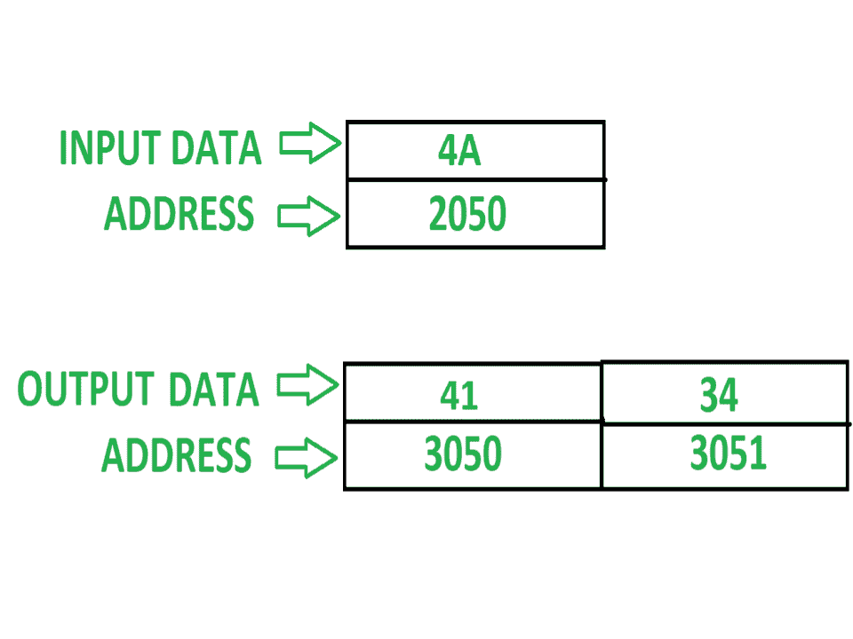

# 8085 码将二进制数转换为 ASCII 码

> 原文:[https://www . geesforgeks . org/8085-code-convert-binary-number-ascii-code/](https://www.geeksforgeeks.org/8085-code-convert-binary-number-ascii-code/)

**问题–**8085 中的汇编级程序，将二进制数转换为 ASCII 数。

**示例–**

**假设–**必须转换为 ASCII 值的二进制数存储在存储位置 2050，输出将显示在存储位置 3050 和 3051。

**算法–**

1.  加载 2050 的内容。
2.  然后，通过再次加载 2050 的内容并将其旋转一位 4 次来分离号码的 LSB(使用 ANI 0F 指令)和号码的 MSB(然后再次使用 ANI 0F 来分离数字)。
3.  如果该数字大于或等于 0A(以十六进制表示)，则加 37，否则加 30 转换为 ASCII 值(要检查该数字是否大于或等于 A，则使用指令:CPI 0A，然后检查进位标志，如果它为 0，则表示该数字大于或等于 A，如果 1 个数字小于 A)。
4.  现在将两位数字的 ASCII 值分别存储在 3050 和 3051 中。

**程序–**

主要程序:

| 地址 | 记忆术 | 评论 |
| --- | --- | --- |
| Two thousand | LDA 2050 | 一 |
| Two thousand and three | 拨打 2500 | 转到地址 2500 |
| Two thousand and six | STA 3050 | 一->[3050] |
| Two thousand and nine | LDA 2050 | 一 |
| 200 摄氏度 | RLC | 将数字向左旋转一位，不带进位 |
| 200D | RLC | 将数字向左旋转一位，不带进位 |
| 200E | RLC | 将数字向左旋转一位，不带进位 |
| 200F | RLC | 将数字向左旋转一位，不带进位 |
| Two thousand and ten | 拨打 2500 | 转到地址 2500 |
| Two thousand and thirteen | STA 3051 | 一->[3051] |
| Two thousand and sixteen | HLT | 终止程序 |

子程序:

| 地址 | 记忆术 | 评论 |
| --- | --- | --- |
| Two thousand five hundred | 0F 年 |  |
| Two thousand five hundred and two | 消费物价指数 0A | [A]-0A |
| Two thousand five hundred and four | JNC 250A | 如果 carryflag 为 0，跳转到[250A] |
| Two thousand five hundred and seven | ADI 30 | 一 |
| Two thousand five hundred and nine | 浸水使柔软 | 返回到主程序中调用子程序地址的下一条指令 |
| 250A | ADI 37 | A |
| 250 摄氏度 | 浸水使柔软 | 返回到主程序中调用子程序地址的下一条指令 |

**解释–**

主要程序:

1.  **LDA 2050:** 该指令将地址 2050 中的数字加载到累加器中。
2.  **CALL 2500:** 该指令将在它之后停止执行主例程指令，并将移动到子程序地址 2500 以执行子任务，并且在执行子程序指令之后，它将回到主例程并在 CALL 2500 之后执行指令。
3.  **STA 3050:** 该指令将累加器的结果(在子程序中执行)存储到地址 3050。
4.  **LDA 2050:** 该指令将再次将地址 2050 中的号码加载到累加器中，因为累加器中先前加载的号码发生了变化。
5.  **RLC:** 将累加器的内容向左旋转一位，不进位。
6.  **RLC:** 将累加器的内容向左旋转一位，不进位。
7.  **RLC:** 将累加器的内容向左旋转一位，不进位。
8.  **RLC:** 将累加器的内容向左旋转一位，不进位。
    (使用 RLC 4 次，将反转蓄压器的内容)
9.  **9。CALL 2500:** 该指令将在它之后停止执行主例程指令，并且将移动到用于执行子任务的子例程地址 2500，并且在执行子例程指令之后，它将回到主例程并且在 CALL 2500 之后执行指令。
10.  **10。STA 3051:** 该指令将累加器的结果(在子程序中执行)存储到地址 3051。
11.  **11 时。HLT:** 该指令将终止程序。

子程序:

1.  **ANI 0F:** 该指令将分离累加器中存在的数字的 LSB，并将结果存储回累加器中。
2.  **CPI 0A:** 该指令将累加器的内容与 0A 进行比较，即【A】-0A。
3.  **JNC 205A:** 如果 carryflag 变为 0，则它将跳转到 205A，否则将移动到下一条指令。
4.  **ADI 30:** 它会将 30 加到累加器的内容中，并将结果再次存储回累加器中。
5.  **RET:** 现在会在 CALL 的下一条指令后移回主例程，开始执行主例程的指令。
6.  <strongadi strong="">将累加器的内容加 37，再次将结果存储回累加器。</strongadi>
7.  **RET:** 现在会在 CALL 的下一条指令后移回主例程，开始执行主例程的指令。

下一篇: [8085 程序将 8 位 BCD 号转换为 ASCII 码](https://www.geeksforgeeks.org/8085-program-convert-8-bit-bcd-number-ascii-code/)