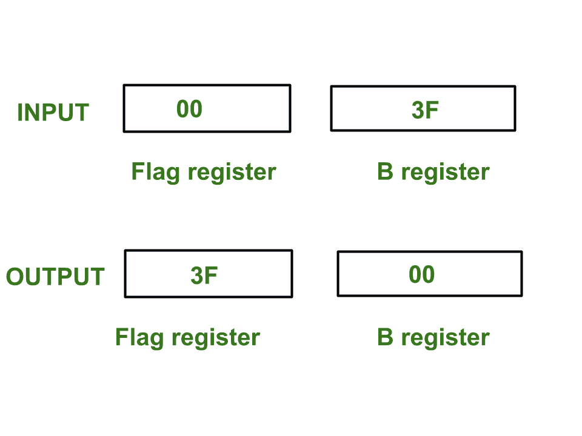

# 8085 程序访问标志寄存器的内容并与寄存器 B

交换

> 原文:[https://www . geesforgeks . org/8085-程序-访问-交换-内容-标志-注册-注册-b/](https://www.geeksforgeeks.org/8085-program-access-exchange-content-flag-register-register-b/)

**问题–**在 8085 微处理器中编写汇编语言程序，访问 flag 寄存器，将 Flag 寄存器 F 的内容与寄存器 b 进行交换。

**示例–**



**假设–**标志寄存器、寄存器 B 和堆栈指针的初始值分别为 is 00、3F 和 3FFF。

PSW 代表**程序状态字**。PSW 结合了累加器 A 和标志寄存器 F。

**算法–**

1.  借助**推送**指令，推送内存堆栈中 **PSW** 的值
2.  借助 **POP** 指令，弹出标志寄存器的值并将其存储在寄存器 H 中
3.  移动寄存器 C 中寄存器 H 的值
4.  移动寄存器 H 中寄存器 B 的值
5.  移动寄存器 B 中寄存器 C 的值
6.  借助 **PUSH** 指令推内存栈中寄存器 H 的值
7.  使用**弹出**指令从内存堆栈中弹出 **PSW** 的值

**程序–**

| <font color="green">内存地址</font> | <font color="green">助记符</font> | comment |
| <font color="black">2000</font> | <font color="black">推送 PSW</font> | <font color="black">堆栈中累加器和标志的推送值</font> |
| <font color="black">2001</font> | <font color="black">POP H</font> | <font color="black">H 中内存堆栈顶部的弹出值</font> |
| <font color="black">2002</font> | <font color="black">MOV C，H</font> | <font color="black">C < - H</font> |
| <font color="black">2003</font> | <font color="black">MOV H，B</font> | <font color="black">H<-B</font> |
| <font color="black">2004</font> | <font color="black">MOV B、C</font> | <font color="black">B<-C</font> |
| <font color="black">2005</font> | T21】PUSH H | <font color="black">推寄存器 H</font> |
| 的值 |

**解释–**使用的寄存器 A、B、C、H、F

1.  **推送 PSW** 指令执行以下任务:

    ```
        SP <- SP - 1
        M[SP] <- A
        SP <- SP - 1
        M[SP] <- F
    ```

2.  **POP H** 指令执行以下任务:

    ```
        H <- M[SP]
        SP <- SP + 1
    ```

3.  **MOV C，H–**移动寄存器 C 中 H 的值
4.  **MOV H，B–**移动寄存器 H 中 B 的值，因此 H 被更新
5.  **MOV B，C–**移动寄存器 B 中 C 的值，因此 B 被更新
6.  **推送 H** 执行以下任务:

    ```
        SP <- SP - 1
        M[SP] <- H
    ```

7.  **POP PSW** 执行以下任务:

    ```

        F <- M[SP]
        SP <- SP + 1
        A <- M[SP]
        SP <- SP + 1
    ```

8.  **HLT–**停止执行程序并停止任何进一步的执行