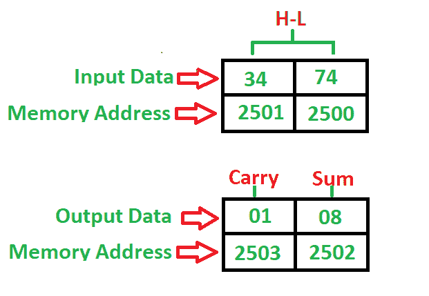

# 8085 程序添加 2-BCD 号

> 原文:[https://www . geesforgeks . org/8085-program-add-2-BCD-numbers/](https://www.geeksforgeeks.org/8085-program-add-2-bcd-numbers/)

**问题**–编写一个程序，将起始地址为 **2000** 的 2-BCD 号码相加，号码存储在 **2500** 和 **2501** 内存地址，并将总和存储到 **2502** 中，进位到 **2503** 内存地址中。

**示例–**

**算法–**

1.  将 00H 载入寄存器(用于进位)
2.  将内容从存储器载入寄存器对
3.  将内容从 L 寄存器移到累加器
4.  用累加器添加 H 寄存器的内容
5.  如果总和大于 9 或辅助进位不为零，则加 06H
6.  如果进位标志不等于 1，转到步骤 8
7.  进位寄存器递增 1
8.  将累加器的内容存储到内存中
9.  将内容从进位寄存器移到累加器
10.  将累加器的内容存储到内存中
11.  停止

**程序–**

| 记忆 | 记忆术 | 操作数 | 评论 |
| --- | --- | --- | --- |
| Two thousand | MVI | c，00H |  |
| Two thousand and two | 勒瓦尔德 | [2500] | [高-低] |
| Two thousand and five | MOV | 洛杉矶 | [阿] |
| Two thousand and six | 注意缺陷障碍 (Attention Deficit Disorder) | H | [甲] |
| Two thousand and seven | DAA |  | 如果总和> 9 或 AC = 1，则加 06 |
| Two thousand and eight | JNC | 200 摄氏度 | 没有进位就跳 |
| 200B | 印度卢比 | C | [C] |
| 200 摄氏度 | 无线电台临时使用许可证 | [2502] | [一] -> [2502]，总和 |
| 200F | MOV | 甲，丙 | [甲] |
| Two thousand and ten | 无线电台临时使用许可证 | [2503] | [一] -> [2503]，随身携带 |
| Two thousand and thirteen | HLT |  | 停止 |

**说明–**寄存器 A、C、H、L 用于通用目的

1.  **MVI** 用于将数据立即移入任何寄存器(2 字节)
2.  **LHLD** 用于使用 16 位地址(3 字节指令)直接加载寄存器对
3.  **MOV** 用于将数据从内存传输到累加器(1 字节)
4.  **ADD** 用于将累加器与任意寄存器相加(1 字节指令)
5.  **STA** 用于将数据从累加器存储到内存地址(3 字节指令)
6.  **DAA** 用于检查和> 9 或 AC = 1 相加 06 (1 字节指令)
7.  **如果没有进位到给定的存储位置(3 字节指令)，则使用 JNC** 跳转
8.  **INR** 用于给定寄存器增加 1 (1 字节指令)
9.  **HLT** 用于暂停程序