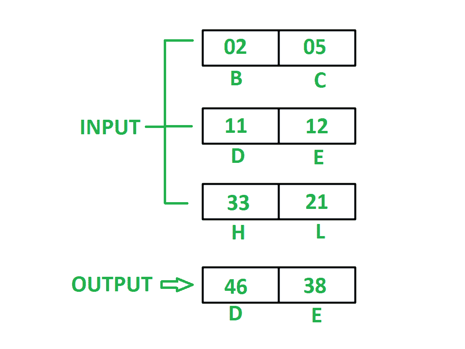

# 8085 程序将寄存器

中存储的三个 16 位数字相加

> 原文:[https://www . geesforgeks . org/8085-program-add-三位 16 位数字-存储寄存器/](https://www.geeksforgeeks.org/8085-program-add-three-16-bit-numbers-stored-registers/)

**问题–**编写汇编语言程序，将存储在寄存器 HL、DE、BC 中的三个 16 位数字相加，用最少的指令数将结果存储在 DE 中。

**示例–**



**假设–**

1.  要添加的号码已经存储在寄存器 h1、DE、BC 中
2.  存储在寄存器中的数字使得最终结果不应大于 FFFF

**DAD D** 执行以下任务:

```
  H <- H + D 
  L <- L + E 
```

DAD 指令取一个自变量，自变量可以是寄存器 B、D、H 或 SP **XCHG** 指令用 H 交换寄存器 D 的内容，用 L 交换寄存器 E 的内容

**算法–**

1.  借助 **DAD** 指令，将 DE 寄存器的内容添加到 HL 中，并将结果存储到 HL 中
2.  将寄存器 B 的内容移到 D，将寄存器 C 的内容移到 E
3.  重复步骤 1
4.  用 XCHG 指令将 DE 的内容换成 HL。我们会在德得到结果

**程序–**

<center>

| <font color="green">内存地址</font> | <font color="green">助记符</font> | comment |
| <font color="black">2000</font> | <font color="black">爸爸</font> | <font color="black">H < - H + D，L < - L + E</font> |
| <font color="black">2001</font> | <font color="black">MOV D，B</font> | <font color="black">D < - B</font> |
| <font color="black">2002</font> | <font color="black">MOV E，C</font> | <font color="black">E < - C</font> |
| <font color="black">2003</font> | <font color="black">爸爸</font> | <font color="black">H < - H + D，L < - L + E</font> |
| <font color="black">2004</font> | <font color="black">XCHG</font> | <font color="black">用 DE 交换 HL 的内容</font> |

</center>

<font color="black">2005</font> <font color="black">HLT</font> <font color="black">END</font>

**解释–**

1.  **DAD D–**将 H 中的寄存器 D 和 L 中的寄存器 E 的内容相加，并将结果存储在 HL 中
2.  **MOV D，B–**移动寄存器 D 中寄存器 B 的值
3.  **MOV E，C** 移动寄存器 E 中寄存器 C 的值
4.  与步骤 1 相同
5.  **XCHG–**用寄存器 D 交换寄存器 H 的内容，用寄存器 e 交换寄存器 L 的内容。
6.  **HLT–**停止执行程序并停止任何进一步的执行