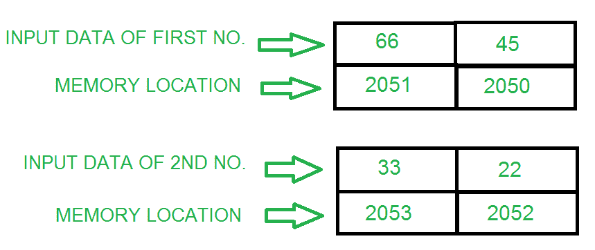
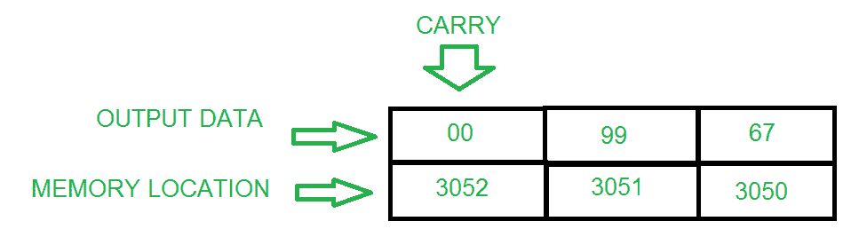

# 8085 程序添加两个 16 位数字

> 原文:[https://www . geesforgeks . org/8085-program-add-two-16 位数字/](https://www.geeksforgeeks.org/8085-program-add-two-16-bit-numbers/)

**问题–**编写一个汇编语言程序，通过使用:

*   (a) 8 位操作
*   (b) 16 位操作

**示例–**

**(a)使用 8 位操作添加 16 位数字–**这是一种冗长的方法，与 16 位操作相比需要更多的内存。

**算法–**

1.  将第一个数字的下半部分载入 B 寄存器
2.  将第二个数字的下半部分装入 A(累加器)
3.  将数字和存储相加
4.  将第一个数字的较高部分载入 B 寄存器
5.  将第二个数字的较高部分装入 A(累加器)
6.  从较低的字节(如果有的话)开始将两个数字相加并存储在下一个位置

**程序–**

| 存储地址 | 记忆术 | 评论 |
| --- | --- | --- |
| Two thousand | LDA 2050 | A ← 2050 |
| Two thousand and three | 莫夫 b，a | 乙←甲 |
| Two thousand and four | LDA 2052 | A ← 2052 |
| Two thousand and seven | 添加 B | A ← A+B |
| Two thousand and eight | STA 3050 | A → 3050 |
| 200B | LDA 2051 | A ← 2051 |
| 200E | 莫夫 b，a | 乙←甲 |
| 200F | LDA 2053 | A ← 2053 |
| Two thousand and twelve | 模数转换器 | A ← A+B+CY |
| Two thousand and thirteen | STA 3051 | A → 3051 |
| Two thousand and sixteen | HLT | 停止执行 |

**解释–**

1.  **LDA 2050** 将 2050 时的值存储在 A(累加器)中
2.  **MOV B，A** 将 A 的值存入 B 寄存器
3.  **LDA 2052** 将 2052 的值存储在 A 中
4.  **添加 B** 添加 B 和 A 的内容，保存在 A 中
5.  **STA 3050** 将结果存储在存储单元 3050 中
6.  **LDA 2051** 将 2051 的值存储在 A 中
7.  **MOV B，A** 将 A 的值存入 B 寄存器
8.  **LDA 2053** 将 2053 的值存储在 A 中
9.  **ADC B** 将 B、A 的内容相加，从低位相加进位，存入 A
10.  **STA 3051** 将结果存储在存储单元 3051 中
11.  **HLT** 停止执行

**(b)使用 16 位操作添加 16 位数字–**这是一种非常短的方法，与 8 位操作相比，也需要更少的内存。

**算法–**

1.  一次加载第一个数字的低位和高位
2.  将第一个数字复制到另一个寄存器对
3.  同时加载第二个数的低位和高位
4.  将两个寄存器对相加，并将结果存储在内存位置

**程序–**

| 存储地址 | 记忆术 | 评论 |
| --- | --- | --- |
| Two thousand | LHLD 2050 年 | h-l 5920.2050 年欧洲足球锦标赛 |
| Two thousand and three | XCHG 表示 | D  H & E  L |
| Two thousand and four | 勒瓦尔德 2052 | h-l 5922 战斗机 |
| Two thousand and seven | 爸爸 D | H+D 和 L+E |
| Two thousand and eight | SHLD 3050 突击步枪 | A → 3050 |
| 200B | HLT | 停止执行 |

**解释–**

1.  **LHLD 2050** 将 2050 处的值载入 L 寄存器，将 2051 处的值载入 H 寄存器(第一个数字)
2.  **XCHG** 将 H 的内容复制到 D 寄存器，将 L 的内容复制到 S 寄存器
3.  **LHLD 2052** 加载 L 寄存器中 2052 处的值和 H 寄存器中 2053 处的值(第二个数)
4.  **DAD D** 将 H 的值与 D 相加，将 L 的值与 E 相加，并将结果存储在 H 和 L 中
5.  **SHLD 3050** 将结果存储在存储器位置 3050
6.  **HLT** 停止执行