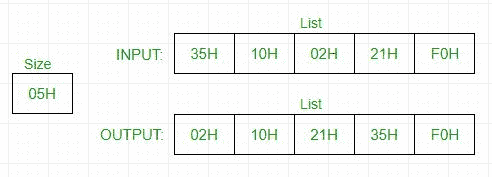

# 8085 气泡排序程序

> 原文:[https://www.geeksforgeeks.org/8085-program-bubble-sort/](https://www.geeksforgeeks.org/8085-program-bubble-sort/)

先决条件–[冒泡排序](https://www.geeksforgeeks.org/bubble-sort/)
**问题–**在 8085 微处理器中编写一个汇编语言程序，使用冒泡排序对给定的 n 个数进行排序。

**示例–**

**假设–**列表大小存储在 2040 小时，列表编号从 2041 小时开始。

**算法–**

1.  在 C 寄存器中加载列表的大小，并将 D 寄存器设置为 0
2.  对于 n 个元素，进行 n-1 次比较
3.  将列表的起始元素加载到累加器中
4.  比较累加器和下一个元素
5.  如果累加器小于或等于下一个元素，跳到步骤 8
6.  交换两个元素
7.  将 D 寄存器设为 1
8.  减量 C
9.  如果 C>0，取累加器中的下一个元素，转到第 4 点
10.  如果 D=0，这意味着在迭代中，没有交换发生，因此我们知道它不会在进一步的迭代中发生，所以循环退出，程序停止
11.  跳至步骤 1 进行进一步的迭代

**程序–**

<figure class="table">

| 地址 | 标签 | 指令 | 评论 |
| --- | --- | --- | --- |
| 2000 小时 | 开始 | lxi h 2040 小时 | 加载数组大小 |
| 2003H |   | MVI D，00 小时 | 清除 D 寄存器以设置标志 |
| 2005H |   | 莫夫·c·m | 用列表中的元素数设置 C 寄存器 |
| 2006H |   | DCR C(消歧义) | 减量 C |
| 2007H |   | INX H(消歧义) | 增加内存以访问列表 |
| 2008H | 支票 | 莫夫 a，m | 在累加器中检索列表元素 |
| 2009H |   | INX H(消歧义) | 增加内存以访问下一个元素 |
| 200AH |   | CMP M 号航空母舰 | 比较累加器和下一个元素 |
| 200BH |   | jc nextbyte 交易 | 如果累加器较少，则跳转到 NEXTBYTE |
| 200EH |   | JZ 下一个字节 | 如果累加器相等，则跳转到 NEXTBYTE |
| 2011H |   | 莫夫 b，m | 交换两个元素 |
| 2012H |   | 莫夫 m，a |   |
| 2013H |   | DCX 小时数 |   |
| 2014H |   | 莫夫 m，b |   |
| 2015H |   | INX H(消歧义) |   |
| 2016H |   | MVI D，01 小时 | 如果发生交换，将 01 保存在 D 寄存器中 |
| 2018H | NEXTBYTE | DCR C(消歧义) | 为下一次迭代递减 C |
| 2019H |   | JNZ 检查 | 如果 C>0，跳转到检查 |
| 201CH |   | 莫夫 a，d | 将数据内容转移到累加器 |
| 201DH |   | 消费物价指数 01H | 将累加器内容与 01H 进行比较 |
| 201FH |   | JZ 开始 | 如果 D=01H，跳到开始 |
| 2022H |   | HLT | 停止 |

**解释-**

*   检索累加器中的元素。
*   将其与下一个元素进行比较，如果大于，则交换，否则移至下一个索引。
*   如果在一个完整的循环中没有交换，暂停，否则重新开始整个迭代。
*   The following approach has two loops, one nested inside other so- 

    最坏和平均情况时间复杂度:0(n * n)。当数组被反向排序时会出现最坏的情况。
    最佳情况时间复杂度:O(n)。最佳情况发生在数组已经排序的时候。

</figure>