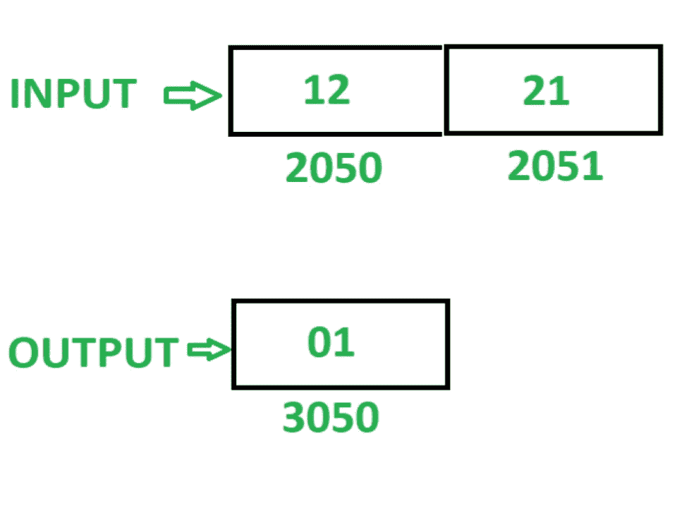
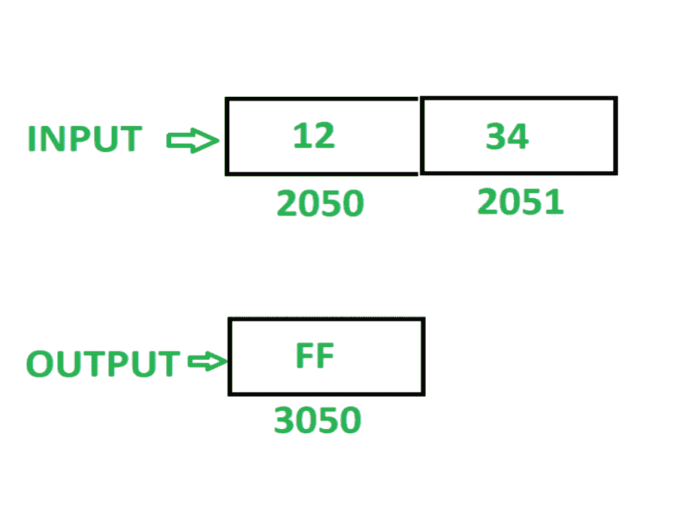

# 8085 程序检查给定的 16 位数字是否回文

> 原文:[https://www . geesforgeks . org/8085-程序-检查-是否-给定-16 位数字-回文-非/](https://www.geeksforgeeks.org/8085-program-check-whether-given-16-bit-number-palindrome-not/)

**问题–**编写汇编语言程序，检查给定的 16 位数字是否是回文。如果数字是回文，则在存储器位置 3050 存储 01，否则在存储器位置 3050 存储 FF。

**注–**回文数字是指当数字反转时保持不变的数字。

假设 16 位数字，为了检查回文被存储在存储器位置 2050。

**示例–**

**算法–**

1.  加载寄存器 L 中存储单元 2050 的内容和寄存器 H 中存储单元 2051 的内容
2.  移动累加器 A 中 L 的内容
3.  通过执行 RLC 指令 4 次来反转 A 的内容
4.  将 A 的内容移入 L
5.  在 A 中移动 H 的内容
6.  通过执行 RLC 指令 4 次来反转 A 的内容
7.  在 H 中移动 L 的内容
8.  将 A 的内容移入 L
9.  在存储单元 2070 中存储 L 的内容，在存储单元 2071 中存储 H 的内容
10.  加载内存位置 2050 的内容
11.  在寄存器 B 中移动 A 的内容
12.  加载内存位置 2070 的内容
13.  比较 A 和 b 的内容。如果内容不相同，则将 FF 存储在 A 中，并将其存储在存储单元 3050 中
14.  如果 A 和 B 的内容相同，则将存储单元 2051 的内容加载到 A 中
15.  在 B 中移动 A 的内容
16.  加载内存位置 2071 的内容
17.  比较 A 和 b 的内容。如果内容不相同，则将 FF 存储在 A 中，并将其存储在存储单元 3050 中
18.  如果 A 和 B 的内容相同，则将 01 存储在 A 中，并将其存储在存储单元 3050 中

**程序–**

| 存储地址 | 记忆术 | 评论 |
| 2000 | LHLD 2050 | L<-M【2050】，H<-M【2051】 |
| 2003 | MOV A，L | A < - L |
| 2004 | RLC | 将累加器内容旋转 1 位，不进位 |
| 2005 | RLC | 将累加器内容旋转 1 位，不进位 |
| 2006 | RLC | 将累加器内容旋转 1 位，不进位 |
| 2007 | RLC | 将累加器内容旋转 1 位，不进位 |
| 2008 | MOV L，A | L < - A |
| 2009 | MOV A，H | A < - H |
| 200A | RLC | 将累加器内容旋转 1 位，不进位 |
| 200B | RLC | 将累加器内容旋转 1 位，不进位 |
| 200 摄氏度 | RLC | 将累加器内容旋转 1 位，不进位 |
| 200D | RLC | 将累加器内容旋转 1 位，不进位 |
| 200E | MOV H，L | H < - L |
| 200F | MOV L，A | L < - A |
| 2010 | SHLD 2070 | M【2070】<-L，M【2071】<-H |
| 2013 | LDA 2050 | A<-M【2050】 |
| 2016 | MOV B，A | B < - A |
| 2017 | LDA 2070 | A<-M【2070】 |
| 201A | CMP B | 甲–乙 |
| 201B | JZ 2024 | 如果 ZF = 0 则跳转 |
| 201E | MVI A，FF | A < - 01 |
| 2020 | 他们是 3050 | M【3050】<-A |
| 2023 | HLT | 结束 |
| 2024 | LDA 2051 | A<-M【2051】 |
| 2027 | MOV B，A | B < - A |
| 2028 | LDA 2071 | A<-M【2071】 |
| 202B | CMP B | 甲–乙 |
| 202C | JZ 2035 | 如果 ZF = 0 则跳转 |
| 202F | MVI A，FF | A < - FF |
| 2031 | 他们是 3050 | M【3050】<-A |
| 2034 | HLT | 结束 |
| 2035 | mvi a.01 | A < - 01 |
| 2037 | 他们是 3050 | M【3050】<-A |
| 203A | HLT | 结束 |

**说明–**寄存器 A、H、L、B 用于通用。

1.  **LHLD 2050:** 加载内存位置 2050 在 L，2051 在 h 的内容。
2.  **MOV A，L:** 移动 A 中 L 的含量
3.  **RLC:** 将 A 的内容左移一位，不进位。重复当前指令 4 次，使 A 的内容反转。
4.  **MOV L，A:** 移动 L 中 A 的含量
5.  **MOV A，H:** 移动 A 中 H 的含量
6.  **RLC:** 将 A 的内容左移一位，不进位。重复当前指令 4 次，使 A 的内容反转。
7.  **MOV H，L:** 移动 H 中 L 的含量
8.  **MOV L，A:** 移动 L 中 A 的含量
9.  **SHLD 2070:** 存储 2070 年的 L 和 2071 年的 H 的含量。
10.  **LDA 2050:** 加载 a 中内存位置 2050 的内容。
11.  **MOV B，A:** 移动 B 中 A 的内容
12.  **CMP B:** 比较 A 和 B 的内容，如果内容相同则置零标志，否则复位。
13.  **JZ 2024:** 如果 ZF = 1，跳到记忆位置 2024。
14.  **MVI A，FF:** 把 FF 存放在 A
15.  **STA 3050:** 在 3050 中存储 A 的内容。
16.  **HLT:** 停止执行程序并停止任何进一步的执行。
17.  **LDA 2051:** 加载 a 中内存位置 2050 的内容。
18.  **MOV B，A:** 移动 B 中 A 的内容
19.  **LDA 2071:** 加载 a 中内存位置 2071 的内容。
20.  **CMP B:** 比较 A 和 B 的内容，如果内容相同则置零标志，否则复位。
21.  **JZ 2035:** 如果 ZF = 1，跳到记忆位置 2035。
22.  **MVI A，FF:** 把 FF 存放在 A
23.  **STA 3050:** 在 3050 中存储 A 的内容。
24.  **HLT:** 停止执行程序并停止任何进一步的执行。
25.  **MVI A，01:**01 店在 A
26.  **STA 3050:** 在 3050 中存储 A 的内容。
27.  **HLT:** 停止执行程序并停止任何进一步的执行。