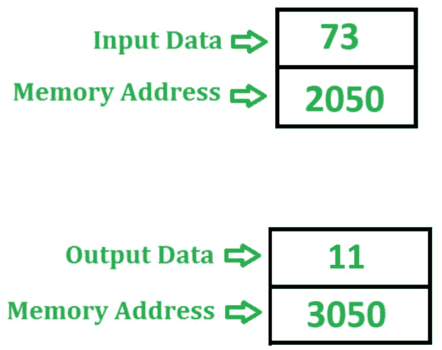
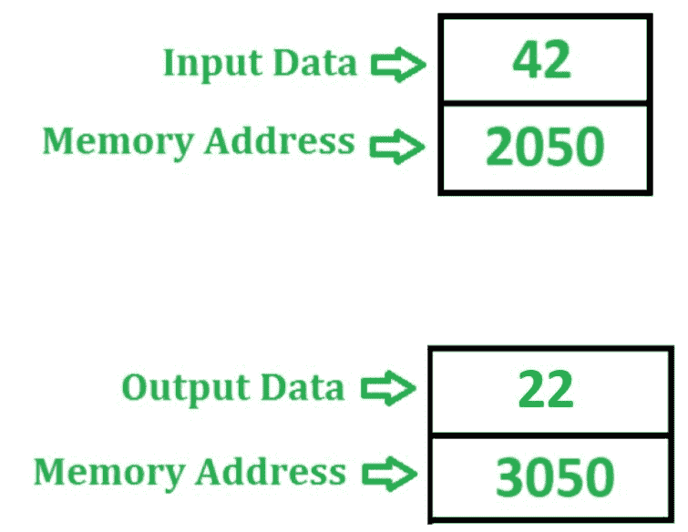

# 8085 程序检查给定数字是偶数还是奇数

> 原文:[https://www . geesforgeks . org/8085-程序-检查-是否-给定-数字-偶数-奇数/](https://www.geeksforgeeks.org/8085-program-check-whether-given-number-even-odd/)

**问题–**在 8085 微处理器中编写汇编语言程序，检查存储在存储单元 2050 中的 8 位数字是偶数还是奇数。如果是偶数，则在存储器位置 3050 存储 22，否则在存储器位置 3050 存储 11。

**示例–**

如果一个数字的低位是 1，则称其为奇数，否则称其为偶数。因此为了识别数字是偶数还是奇数，我们借助 **ANI** 指令用 01 进行 AND 运算。如果数字是奇数，那么我们将得到 01，否则累加器中为 00。**阿尼**指令也影响 8085 的旗帜。因此，如果累加器包含 00，则置零标志，否则复位。

**算法–**

1.  将内存位置 2050 的内容加载到累加器 a 中
2.  在 **ANI** 指令的帮助下，用累加器 A 的值 01 执行“与”运算。
3.  检查是否设置了零标志，即如果 ZF = 1，则将 22 存储在累加器 A 中，否则将 11 存储在 A 中
4.  将 A 的值存储在存储单元 3050 中

**程序–**

【jmp 200 f【跳转到记忆位置】

| 内存地址 | 助记符 | comment |
| 2000 | LDA 2050 | A<-M【2050】 |
| 2003 | ANI 01 | A < - A(与)01 |
| 2005 | JZ 200D | 如果 ZF = 1 跳跃 |
| 2008 | MVI A 11 | a<-11 |
| 【200 a】 |

**解释–**使用的寄存器 A:

1.  **LDA 2050–**将内存位置 2050 的内容加载到累加器 A 中
2.  **ANI 01–**在累加器 A 和 01 之间执行“与”运算，并将结果存储在 A 中
3.  **如果 ZF = 1，JZ 200D–**跳转到存储位置 200d
4.  **MVI a11–**将 11 分配给累加器
5.  **JMP 200F–**跳转到内存位置 200 f
6.  **MVI a22–**将 22 分配给累加器
7.  **STA 3050–**在 3050 中存储 A 的值
8.  **HLT–**停止执行程序并停止任何进一步的执行