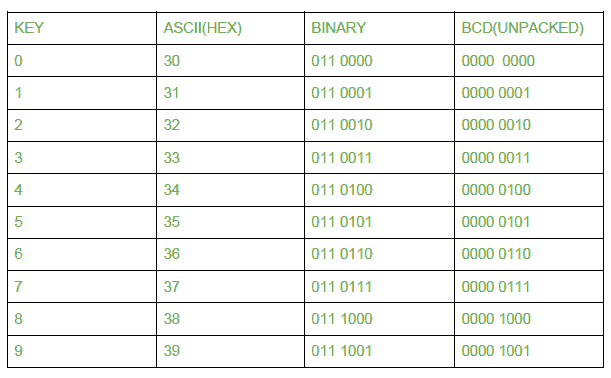
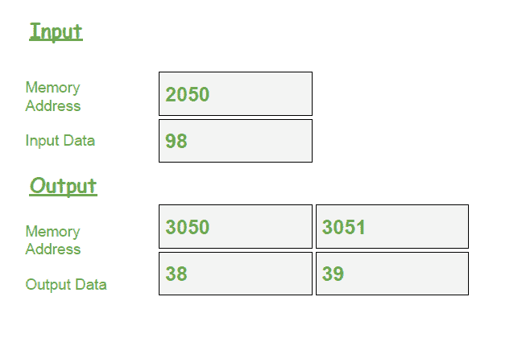

# 8085 程序将 8 位 BCD 号转换为 ASCII 码

> 原文:[https://www . geesforgeks . org/8085-program-convert-8 位-bcd-number-ascii-code/](https://www.geeksforgeeks.org/8085-program-convert-8-bit-bcd-number-ascii-code/)

**问题–**编写一个汇编级语言程序，将 8 位 BCD 号转换为其各自的 ACSII 代码。

**假设–**
程序起始地址:2000
输入内存位置:2050
输出内存位置:3050 和 3051

**数字 0-9 的 ASCII 码**

**示例–**

**算法–**

1.  在累加器中输入 2050 的内容
2.  将累加器的内容移到寄存器 B
3.  使用“与”和“0F”将最低有效数字分开，并将 30 加到累加器上
4.  将累加器的内容存储到存储器位置 3050
5.  将寄存器 B 的内容移至累加器
6.  用“与”和 F0 分隔最高有效数字
7.  将累加器的内容旋转 4 次
8.  向累加器添加 30
9.  将累加器的内容存储到存储器位置 3051

**程序–**

| 地址 | 记忆术 | 评论 |
| --- | --- | --- |
| Two thousand | LDA 2050 | 一 |
| Two thousand and three | 莫夫 b，a | B |
| Two thousand and four | 0F 年 | A |
| Two thousand and six | ADI 30 | A |
| Two thousand and eight | STA 3050 | [3050] |
| 200B | 莫夫 a b | A |
| 200 摄氏度 | 阿尼 F0 | A |
| 200E | RLC | 向左旋转 |
| 200F | RLC | 向左旋转 |
| Two thousand and ten | RLC | 向左旋转 |
| Two thousand and eleven | RLC | 向左旋转 |
| Two thousand and twelve | ADI 30 | A |
| Two thousand and fourteen | STA 3051 | [3051] |
| Two thousand and seventeen | HLT | 停止执行 |

**解释–**

1.  **LDA 2050** 将存储单元 2050 的内容加载到累加器中
2.  **MOV B，A** 将累加器的内容复制到寄存器 B
3.  **ANI 0F** 和带有即时数据 0F 的累加器的内容
4.  **ADI 30** 向蓄能器添加 30
5.  **STA 3050** 将累加器的内容存储到存储单元 3050
6.  **MOV A、B** 将寄存器 B 的内容复制到累加器中
7.  **ANI F0** 和带有即时数据 F0 的累加器的内容
8.  **RLC** 旋转蓄压器中没有进位的内容
9.  **RLC** 旋转蓄压器中没有进位的内容
10.  **RLC** 旋转蓄压器中没有进位的内容
11.  **RLC** 旋转蓄压器中没有进位的内容
12.  **ADI 30** 向蓄能器添加 30
13.  **STA 3051** 将累加器的内容存储到存储单元 3051
14.  **HLT** 停止程序执行