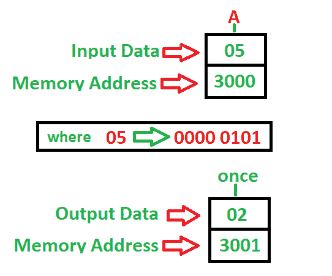

# 8085 程序对给定 8 位数字中的 1 进行计数

> 原文:[https://www . geesforgeks . org/8085-程序-计数-数字-给定-8 位数字/](https://www.geeksforgeeks.org/8085-program-count-number-given-8-bit-number/)

**问题**–编写程序对给定 8 位数中的 1 进行计数，使用寄存器 B 显示 1 的计数，其中起始地址为 **2000** ，该数存储在 **3000** 存储地址，并将结果存储到 **3001** 存储地址。

**示例–**

**算法–**

1.  立即将 00 移至寄存器 B 进行计数
2.  立即将 08 移至寄存器 C 进行移位
3.  将存储器[3000]的数据加载到累加器中
4.  用进位向右旋转“A”
5.  如果没有进位，跳到步骤 7
6.  否则，将寄存器 B 增加 1
7.  将寄存器 C 减少 1
8.  如果不是零，跳到第 4 步
9.  将寄存器 B 的内容移入累加器
10.  将累加器的内容存入存储器[3001] ( **计数次数**)
11.  停止

**程序–**

| 记忆 | 记忆术 | 操作数 | 评论 |
| --- | --- | --- | --- |
| Two thousand | MVI | b，00 | [B] |
| Two thousand and two | MVI | c，08 | [C] |
| Two thousand and four | 皱胃向左移 | [3000] | [一] |
| Two thousand and seven | RAR |  | 用进位向右旋转“A” |
| Two thousand and eight | JNC | 200 摄氏度 | 如果没有进位就跳 |
| 200B | 印度卢比 | B | [乙] |
| 200 摄氏度 | DCR | C | [C] |
| 200D | JNZ | Two thousand and seven | 如果不为零，则跳转 |
| Two thousand and ten | MOV | 甲，乙 | [甲] |
| Two thousand and eleven | 无线电台临时使用许可证 | [3001] | 1 的数量 |
| Two thousand and fourteen | HLT |  | 停止 |

**说明–**寄存器 A、B 和 C 用于通用。

1.  **MVI** 用于立即加载 8 位给定寄存器(2 字节指令)
2.  **LDA** 使用 16 位地址(3 字节指令)直接加载累加器
3.  **MOV** 用于将数据从累加器传输到寄存器(任意)或寄存器(任意)到累加器(1 字节)
4.  **RAR** 用于通过进位(1 字节指令)将‘A’右移
5.  **STA** 用于使用 16 位地址(3 字节指令)将累加器中的数据直接存储到内存中
6.  **INR** 用于给定寄存器增加 1 (1 字节指令)
7.  **JNC** 用于在没有进位(3 字节指令)的情况下跳转到给定步骤
8.  **JNZ** 用于在它们不为零时跳转到给定的步骤(3 字节指令)
9.  **DCR** 用于给定寄存器减 1 (1 字节指令)
10.  **HLT** 用于暂停程序