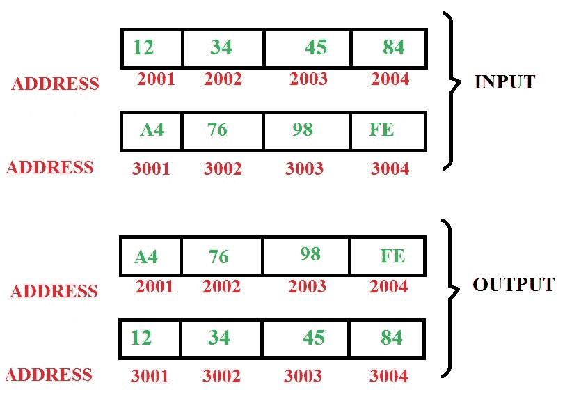

# 8085 程序在内存中交换一块字节

> 原文:[https://www . geesforgeks . org/8085-程序-交换-块-字节-内存/](https://www.geeksforgeeks.org/8085-program-exchange-block-bytes-memory/)

**问题–**在 8085 微处理器中编写汇编级程序，用从地址 3001 开始的数据交换从地址 2001 开始的 4 字节块。

**算法–**

1.  数到 4
2.  将两个模块的起始地址存储在两个不同的寄存器对中
3.  现在交换两个寄存器对中地址的内容
4.  增加两个寄存器对的值
5.  将计数递减 1
6.  如果计数不等于 0，重复步骤 3 至 5

| 存储地址 | 记忆术 | 评论 |
| --- | --- | --- |
| Two thousand five hundred | LXI D 2001 年 | D <= 20，E <= 01 |
| Two thousand five hundred and three | LXI H 3001 | H <= 20，L <= 01 |
| Two thousand five hundred and six | MVI C 04 | C <= 04 |
| Two thousand five hundred and eight | 莫夫 b，m | B <= M[高-低] |
| Two thousand five hundred and nine | LDAX D | 阿< =男[女] |
| 250A | 莫夫 m，a | 男[高-低] <=女 |
| 250B | 莫夫 a b | A <= B |
| 250 摄氏度 | 斯塔 X D | 男[女] |
| 250D | INX H(消歧义) | [高-低] <= [高-低] + 1 |
| 250E | INX D(消歧义) | [ D-E ] <= [ D-E ] + 1 |
| 250F | DCR C(消歧义) | C < = C–1 |
| Two thousand five hundred and ten | JNZ 2508 | 如果 C 不等于 0，跳到 2508 |
| Two thousand five hundred and thirteen | HLT | 停止程序 |

**解释–**

1.  **LXI D 2001–**加载寄存器对，即在这种情况下，D=20 和 E = 01
    LXI H 3001–H = 30 和 L=01
2.  **MVI c04–**分配即时数据，例如-此处 C = 04
    MVI a45–分配 45 的 A(累加器)，A=45
3.  **MOV B，M–**这里 M 是 H–L 寄存器对中的数据，它用作地址。将存储在 M 中的地址的内容复制到寄存器 B
4.  **LDAX D–**此处累加器加载由寄存器对 D–E 形成的地址中存储的数据
5.  **MOV M，A–**此处 A 的内容被复制到存储在 M。
    MOV A，B–将寄存器 B 的内容复制到 A
6.  **statx D–**将 A(累加器)的内容存储在由寄存器对 D–e 构成的地址中
7.  **INX H–**递增寄存器对 H–L 的内容
8.  **INX H–**递增寄存器对 D–E 的内容
9.  **DCR C–**递减寄存器 C 的内容
10.  **JNZ 2508–**如果寄存器 C 的值不等于 0，则跳转到地址 2508
11.  **HLT–**停止程序执行