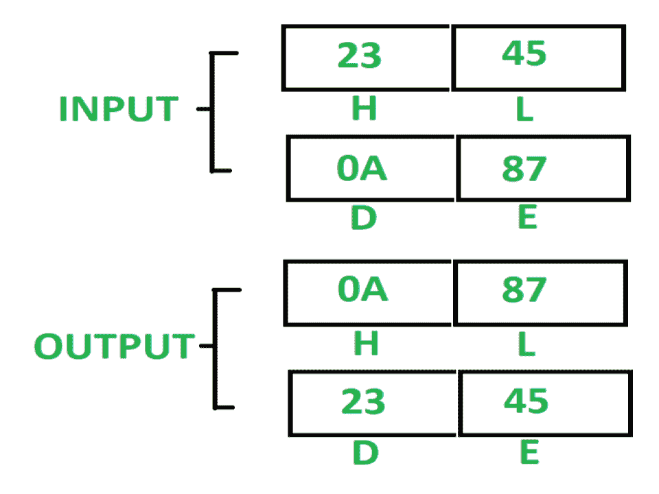

# 8085 程序将 HL 寄存器对的内容与 DE 寄存器对

进行交换

> 原文:[https://www . geesforgeks . org/8085-program-exchange-content-HL-register-pair-de-register-pair/](https://www.geeksforgeeks.org/8085-program-exchange-content-hl-register-pair-de-register-pair/)

**问题–**在 8085 微处理器中编写汇编语言程序，使用 PUSH 和 POP 指令将 HL 寄存器对的内容与 DE 寄存器对进行交换。

**示例–**

**假设–**内容已经存在于 HL 和 DE 寄存器中。

**算法–**

1.  用 3FFF 初始化堆栈指针。
2.  将 H 和 L 寄存器的内容推入堆栈。将速度减 2。
3.  将 D 和 E 寄存器的内容推入堆栈。将速度减 2。
4.  从栈顶取出上面两个字节，放入 HL 寄存器。将 SP 增加 2。
5.  从栈顶取出剩余的两个字节，放入 DE 寄存器。将 SP 增加 2。

**程序–**

| 存储地址 | 记忆术 | 评论 |
| 2000 | lxi SP3 fff | SP < - 3FFF |
| 2003 | 推 H | sp<-sp–1，m【sp】<-h，sp<-sp–1，m【sp】<-l |
| 2004 | 推 D | sp<-sp–1，m【sp】<-d，sp<-sp–1，m【sp】<-e |
| 2005 | POP H | L < - M[SP]，SP < - SP + 1，H < - M[SP]，SP < - SP + 1 |
| 2006 | POP D | E < - M[SP]，SP < - SP + 1，D < - M[SP]，SP < - SP + 1 |
| 2007 | HLT | 结束时间 |

**解释–**使用的寄存器 H、L、D、E:

1.  **LXI SP 3FFF:** 用 3FFF 初始化 SP。
2.  **PUSH H:** 将 H 和 L 寄存器的内容推入堆栈，并将堆栈指针减 2。
3.  **PUSH D:** 将 D 和 E 寄存器的内容推入堆栈，并将堆栈指针减 2。
4.  **POP H:** 从栈顶弹出上面两个字节，放入 HL 寄存器对，SP 递增 2。
5.  **POP D:** 从栈顶弹出上面两个字节，放入 DE 寄存器对，SP 递增 2。
6.  **HLT:** 停止执行程序并停止任何进一步的执行。