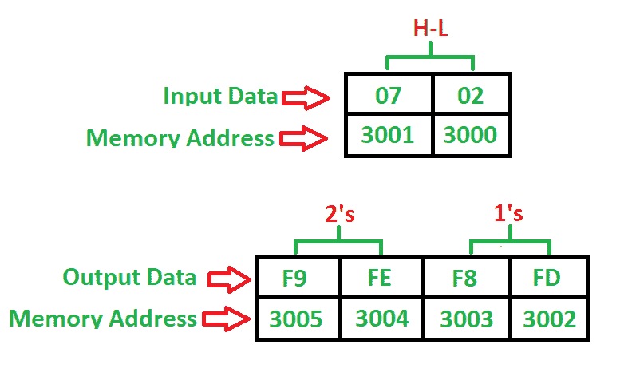

# 8085 程序查找 16 位数字的 1 和 2 补码

> 原文:[https://www . geesforgeks . org/8085-program-find-1s-2s-complex-16 位数字/](https://www.geeksforgeeks.org/8085-program-find-1s-2s-complement-16-bit-number/)

先决条件–[8085 程序查找 8 位数字的 1 和 2 补码](https://www.geeksforgeeks.org/8085-program-find-1s-2s-complement-8-bit-number/)
**问题–**–编写程序查找 16 位数字的 1 和 2 补码，其中起始地址为 **2000** ，该数字存储在 **3000** 内存地址，并将结果存储到 **3002** 和 **3004** 内存地址。

**示例–**

**算法–**

1.  将 16 位数字从存储器 3000 加载到寄存器对(H-L)中
2.  将寄存器 L 的内容移到累加器
3.  累加器的补码内容
4.  将累加器的内容移到寄存器 L
5.  将寄存器 H 的内容移到累加器
6.  累加器的补码内容
7.  将累加器的内容移到寄存器 H
8.  将寄存器对的内容存储在存储器 3002 中( **1 的**补码)
9.  将寄存器对的内容增加 1
10.  将寄存器对的内容存储在存储器 3004 中( **2 的**补码)
11.  停止

**程序–**

| 记忆 | 记忆术 | 操作数 | 评论 |
| --- | --- | --- | --- |
| Two thousand | 勒瓦尔德 | [3000] | [高-低] |
| Two thousand and three | MOV | 洛杉矶 | [阿] |
| Two thousand and four | 军事委员会(Committee of Military Affairs) |  | [阿] |
| Two thousand and five | MOV | 洛杉矶 | [左] |
| Two thousand and six | MOV | a，H | [甲] |
| Two thousand and seven | 军事委员会(Committee of Military Affairs) |  | [阿] |
| Two thousand and eight | MOV | h，A | [H] |
| Two thousand and nine | 嘘嘘嘘嘘嘘嘘嘘嘘嘘嘘嘘嘘嘘嘘嘘嘘嘘嘘嘘 | [3002] | 1 的补码 |
| 200 摄氏度 | INX | H | [高-低] |
| 200D | 嘘嘘嘘嘘嘘嘘嘘嘘嘘嘘嘘嘘嘘嘘嘘嘘嘘嘘嘘 | [3004] | 2 的补码 |
| Two thousand and ten | HLT |  | 停止 |

**解释–**

1.  **A** 是一个 8 位累加器，用于加载和存储数据
2.  **LHLD** 用于直接使用 16 位地址(3 字节指令)加载寄存器对 H-L
3.  **MOV** 用于将数据从累加器传输到寄存器(任意)或寄存器(任意)到累加器(1 字节)
4.  **CMA** 用于补充累加器的内容(1 字节指令)
5.  **SHLD** 用于使用 16 位地址(3 字节指令)将寄存器对 H-L 中的数据直接存储到内存中
6.  **INX** 用于将 H-L 寄存器对增加 1 (1 字节指令)
7.  **HLT** 用于暂停程序