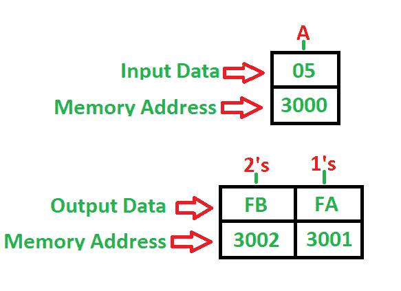

# 8085 程序查找 8 位数字的 1 和 2 补码

> 原文:[https://www . geesforgeks . org/8085-program-find-1s-2s-complex-8 位数字/](https://www.geeksforgeeks.org/8085-program-find-1s-2s-complement-8-bit-number/)

**问题–**编写程序查找 8 位数字的 1 和 2 补码，起始地址为 **2000** ，数字存储在 **3000** 内存地址，并将结果存储到 **3001** 和 **3002** 内存地址。

**示例–**

**算法–**

1.  将存储器 3000 中的数据装入 A(累加器)
2.  累加器的补码内容
3.  将累加器的内容存储在存储器 3001 中(1 的补码)
4.  将 01 添加到累加器内容
5.  将累加器的内容存储在存储器 3002 中(2 的补码)
6.  停止

**程序–**

| 记忆 | 记忆术 | 操作数 | 评论 |
| --- | --- | --- | --- |
| Two thousand | 皱胃向左移 | [3000] | [一] |
| Two thousand and three | 军事委员会(Committee of Military Affairs) |  | [阿] |
| Two thousand and four | 无线电台临时使用许可证 | [3001] | 1 的补码 |
| Two thousand and seven | ADI | 01 | [甲] |
| Two thousand and nine | 无线电台临时使用许可证 | [3002] | 2 的补码 |
| 200 摄氏度 | HLT |  | 停止 |

**解释–**

1.  **A** 是一个 8 位累加器，用于直接加载和存储数据
2.  **LDA** 使用 16 位地址(3 字节指令)直接加载累加器
3.  **CMA** 用于补充累加器的内容(1 字节指令)
4.  **STA** 用于使用 16 位地址(3 字节指令)直接存储累加器
5.  **ADI** 用于立即将数据加入累加器(2 字节指令)
6.  **HLT** 用于暂停程序