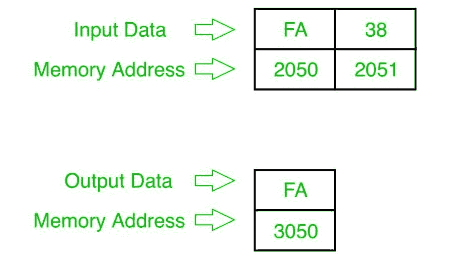

# 8085 程序寻找两个 8 位数字中较大的一个

> 原文:[https://www . geesforgeks . org/8085-program-find-big-two-8 位数字/](https://www.geeksforgeeks.org/8085-program-find-larger-two-8-bit-numbers/)

**问题–**在 8085 微处理器中编写程序，找出两个 8 位数字中较大的一个，其中数字存储在内存地址 2050 和 2051 中，并将结果存储到内存地址 3050 中。

**示例–**

**算法–**

1.  从内存 2050 & 2051 加载两个数字到寄存器 L 和 H。
2.  将一个数字(H)移到累加器 A，并从中减去另一个数字(L)。
3.  如果结果为正，则将数字(H)移动到 A，并将 A 的值存储在存储器地址 3050，然后停止，否则将数字(L)移动到 A，将 A 的值存储在存储器地址 3050，然后停止。

**程序–**

| 存储地址 | 记忆术 | 评论 |
| --- | --- | --- |
| Two thousand | LHLD 2050 年 | h |
| Two thousand and three | 莫夫 a，h | A |
| Two thousand and four | SUB L | A |
| Two thousand and five | 日本 200D | 如果否，跳到 200 天 |
| Two thousand and eight | 莫夫 a，l | 阿 |
| Two thousand and nine | STA 3050 | 一->(内存 3050) |
| 200 摄氏度 | HLT | 停止 |
| 200D | 莫夫 a，h | A |
| 200E | STA 3050 | 一->(内存 3050) |
| Two thousand and eleven | HLT | 停止 |

**解释–**

1.  **LHLD 2050:** 从内存 2050 & 2051 加载数据到寄存器 L 和 h
2.  **MOV A，H:** 将寄存器 H 的内容传送给 A
3.  **SUB L:** 从 A 中减去寄存器 L 的内容，存储到 A 中
4.  **如果结果为正，JP 200D:** 跳转到地址 200D。
5.  **MOV A、L:** 将寄存器 L 的内容传送给 A
6.  **STA 3050:** 将 A 的数据存储到存储器地址 3050。
7.  **HLT:** :结束。
8.  **MOV A，H:** 将寄存器 H 的内容传送给 A
9.  **STA 3050:** 将 A 的数据存储到存储器地址 3050。
10.  **HLT:** 结束。