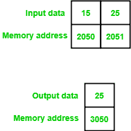

# 8085 程序寻找两个 8 位数字的最大值

> 原文:[https://www . geesforgeks . org/8085-program-find-max-two-8 位数字/](https://www.geeksforgeeks.org/8085-program-find-maximum-two-8-bit-numbers/)

**问题–**编写汇编语言程序，在 8085 微处理器中找到最多两个 8 位数字。

**假设–**起始内存位置和输出内存位置分别为 2050、2051 和 3050。

**示例–**

**算法–**

1.  累加器中的负载值
2.  然后，将该值复制到任何寄存器中
3.  将下一个值载入累加器
4.  比较两个值
5.  检查进位标志，如果复位，则跳到所需的地址来存储该值
6.  将结果复制到累加器中
7.  将结果存储在所需的地址

**程序–**

| 存储地址 | 记忆术 | 评论 |
| --- | --- | --- |
| Two thousand | LDA 2050 | A |
| Two thousand and three | 莫夫 b，a | B |
| Two thousand and four | LDA 2051 | A |
| Two thousand and seven | 《议定书》/《公约》缔约方会议 | A-B |
| Two thousand and eight | jnc 200 足球俱乐部 | 如果进位标志复位(进位标志= 0)，则跳转 |
| 200B | 莫夫 a b | A |
| 200 摄氏度 | STA 3050 | 3050 |
| 200F | HLT | 终止程序 |

**解释–**

1.  **LDA 2050:** 在内存位置 2050 加载值
2.  **MOV B，A:** 给 B 赋值 A
3.  **LDA 2051:** 在内存位置 2051 加载值
4.  **CMP B:** 通过从 A 中减去 B 来比较值
5.  **如果进位标志被重置(进位标志= 0)，则 JNC 200C:** 在存储器位置 200C 跳转
6.  **STA 3050:** 将结果存储在存储器位置 3050
7.  **HLT:** 终止程序