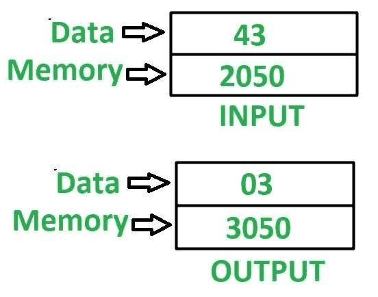

# 8085 程序寻找 8 位数字中数字的最小值

> 原文:[https://www . geesforgeks . org/8085-程序-查找-最小值-数字-8 位数字/](https://www.geeksforgeeks.org/8085-program-find-minimum-value-digit-8-bit-number/)

**问题–**在 8085 微处理器中编写汇编语言程序，求 8 位数字中数字的最小值。

**示例–**假设 8 位数字存储在存储位置 2050，最小值数字存储在存储位置 3050。

**算法–**

1.  将内存位置 2050 的内容加载到累加器 a 中
2.  在寄存器 b 中移动 A 的内容。
3.  用 0F 对 A 的内容进行与运算，并将结果存储在 A 中
4.  在寄存器 c 中移动 A 的内容。
5.  在 a 中移动 B 的内容。
6.  使用 **RLC** 指令反转 A 的内容 4 次。
7.  用 0F 对 A 的内容进行与运算，并将结果存储在 A 中
8.  借助 **CMP C** 指令比较 A 和 C 的内容。
9.  检查是否设置了进位标志，然后跳转到存储位置 2013，否则将 C 的内容移到 a。转到存储位置 2013。
10.  将 A 的值存储在存储单元 3050 中。

**注意–**化学机械抛光 C 指令比较 A 和 C 的值。如果 A > C，则进位标志复位，否则设置。

**程序–**

| 存储地址 | 记忆术 | 评论 |
| 2000 | LDA 2050 | A<-M【2050】 |
| 2003 | MOV B，A | B < - A |
| 2004 | ANI 0F | A < - A(与)0F |
| 2006 | MOV C，A | C < - A |
| 2007 | MOV A，B | A < - B |
| 2008 | RLC | 将累加器的内容向右旋转 1 位，无需进位 |
| 2009 | RLC | 将累加器的内容向右旋转 1 位，无需进位 |
| 200A | RLC | 将累加器的内容向右旋转 1 位，无需进位 |
| 200B | RLC | 将累加器的内容向右旋转 1 位，无需进位 |
| 200 摄氏度 | ANI 0F | A < - A(与)0F |
| 200E | CMP c | A–C |
| 200F | JC 2013 | 如果 CY = 1 则跳转 |
| 2012 | MOV A，C | A < - C |
| 2013 | 他们是 3050 | M【3050】<-A |
| 2016 | HLT | 结束 |

**说明–**寄存器 A、B、C 用于通用。

1.  **LDA 2050:** 加载 a 中内存位置 2050 的内容。
2.  **MOV B，A:** 移动 B 中 A 的内容
3.  **ANI 0F:** 在 A 的内容和 0F 的值之间执行“与”运算。
4.  **MOV C，A:** 移动 C 中 A 的内容
5.  **MOV A，B:** 移动 A 中 B 的内容
6.  **RLC:** 将 A 的内容左移 1 位，不进位。使用此指令 4 次，反转 a 的内容。
7.  **ANI 0F:** 在 A 的内容和 0F 的值之间执行“与”运算。
8.  **CMP C:** 比较 A、C 的内容，并相应更新进位标志的值。
9.  **JC 2013:** 如果 CY = 1，跳转到内存位置 2013。
10.  **MOV A，C:** 移动 A 中 C 的含量
11.  **STA 3050:** 将 A 的内容存储在存储单元 3050 中。
12.  **HLT:** 停止执行程序并停止任何进一步的执行。