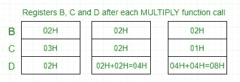

# 8085 程序求一个数的 n 次方

> 原文:[https://www . geesforgeks . org/8085-program-find-n th-power-number/](https://www.geeksforgeeks.org/8085-program-find-nth-power-number/)

**问题–**用 8085 微处理器编写一个计算一个数的 n 次方的汇编语言代码。

**示例–**

```
Input : Base=>02H
        Exponent=>03H  
Output :08H 

```


在 8085 微处理器中，不存在直接将两个数相乘的指令，所以乘法是通过重复加法完成的，因为 4*4 相当于 4+4+4+4(即 4 次)。
将 02H(基数)加载到寄存器 B，将 03H(指数)加载到寄存器 C - >将 D 寄存器设置为 02H - >添加 02H B(ie 2)次- > D 寄存器现在包含 04H - >添加 04H B(ie 2)次- > D 寄存器现在包含 08H - >输出为 08H。



**算法–**

1.  将基数装入寄存器 B，将指数装入寄存器 c。
2.  要开始乘法，请将 D 设置为 01H。
3.  跳到第 7 步。
4.  递减 c。
5.  跳到步骤 3，直到 C 值> 0。
6.  将内存指针指向下一个位置并存储结果。
7.  用 B 的内容物装载 E，并清除蓄能器。
8.  将 D 的内容重复添加到累加器 E 中。
9.  将累加器内容存储到 d。
10.  转到第 4 步。

**程序–**

| 地址 | 标签 | 记忆的 | 评论 |
| --- | --- | --- | --- |
| 2000 小时 | 基础 |  | 基数的数据字节 |
| 2001H | 指数 |  | 指数的数据字节 |
| 2002H | 结果 |  | 阶乘结果 |
|  |  |  |  |
| 2003H |  | LXI H，2000 小时 | 从内存中加载数据 |
| 2006H |  | 莫夫 b，m | 将基数加载到 B 寄存器 |
| 2007H |  | INX H(消歧义) | 增量内存 |
| 2008H |  | 莫夫·c·m | 将指数载入 C 寄存器 |
| 2009H |  | MVI D，01 小时 | 将 D 寄存器设为 1 |
| 200BH | 电源 _ 回路 | 调用乘法 | 乘法子程序调用 |
| 200EH |  | DCR C(消歧义) | 减量 C |
| 200FH |  | JNZ 电源 _ 回路 | 调用 power_loop，直到 C 变为 0 |
| 2012H |  | INX H(消歧义) | 增量内存 |
| 2013H |  | 莫夫·m·d | 将结果存储在内存中 |
| 2014H |  | HLT | 停止 |
|  |  |  |  |
| 2100 小时 | 多样地 | 莫夫和 b | 将 B 的内容转移到 E |
| 2101H |  | MVI A， 00H | 清除累加器以存储结果 |
| 2103H | 多平台 | 增加 | 将 D 的内容添加到 A 中 |
| 2104H |  | DCR 和 | 减量 E |
| 2105H |  | jnz multiplyloop | 叠加 |
| 2108H |  | 莫夫 d，a | 将 A 的内容转移到 D |
| 2109H |  | 浸水使柔软 | 从子程序返回 |

**解释–**

1.  用基数设置寄存器 B，用指数设置寄存器 C。
2.  通过调用乘法子程序一次，将寄存器 D 设置为基数。
3.  通过调用 MULTIPLY 子例程，将 C 减 1，将 D 加到自身 B 倍。
4.  重复上述步骤，直到 C 达到 0，然后退出程序。
5.  结果在存储在存储器中的 D 寄存器中获得