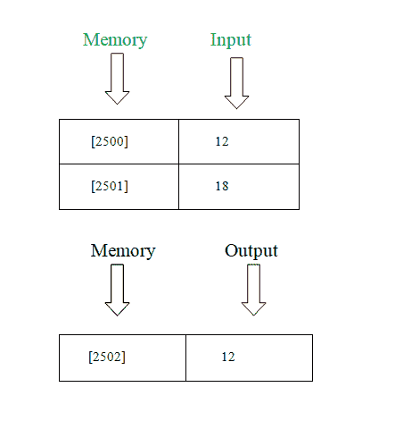

# 8085 程序寻找两个数之间的最小数

> 原文:[https://www . geesforgeks . org/8085-program-find-minist-number-two-numbers/](https://www.geeksforgeeks.org/8085-program-find-smallest-number-two-numbers/)

**问题–**写一个汇编语言程序，在两个数之间找到**最小的数**。

**示例–**

**算法–**

1.  从内存位置
    加载内容
2.  将**累加器**的内容移入**寄存器** B

3.  从**内存位置**
    加载内容
4.  对比**注册** B
    的内容
5.  如果进位标志等于 1，转到步骤 7

6.  将**寄存器** B 的内容移入**累加器**

7.  将内容存储到**内存**

8.  程序结束

**程序–**

<figure class="table">

| 记忆 | 记忆术 | 使用操作数 | 评论 |
| --- | --- | --- | --- |
| Two thousand | 皱胃向左移 | [2500] | [一] |
| Two thousand and three | 莫夫 b，a |   | [乙] |
| Two thousand and four | 皱胃向左移 | Two thousand five hundred and one | [一] |
| Two thousand and seven | 《议定书》/《公约》缔约方会议 |   | [甲] |
| Two thousand and eight | JC * | [200 摄氏度] | 跳跃进位 |
| 200B | 莫夫 a b |   | [甲] |
| 200 摄氏度 | 无线电台临时使用许可证 | [2502] | [一]->[2502] |
| 200F | HLT |   | 停止 |

**解释–**

1.  LDA 用于加载累加器(3 字节指令)。

2.  CMP 用于比较累加器(1 字节指令)的内容。

3.  STA 用于使用 16 位地址(3 字节指令)直接存储累加器。

4.  如果进位，则 JC 跳转(3 字节指令)。

</figure>