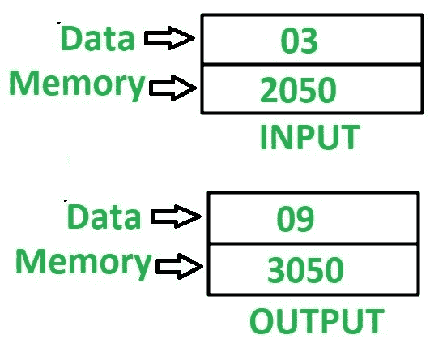

# 8085 程序求一个 8 位数的平方

> 原文:[https://www . geesforgeks . org/8085-program-find-square-8 位数字/](https://www.geeksforgeeks.org/8085-program-find-square-8-bit-number/)

**问题–**在 8085 微处理器中编写汇编语言程序，求 8 位数的平方。

**示例–**

**假设–**输入数据和输出数据的地址分别为 2050 和 3050。

**方法–**结合寄存器 H 和 L 的内容，得到的内容可以用来间接指向内存位置，该内存位置由 m 指定。要找到任何数字的平方，继续将累加器 A 中最初包含 0 的那个数字加上我们需要找到其平方的次数。

**算法–**

1.  将 20 分配给寄存器 H，50 分配给寄存器 L，00 分配给累加器 A
2.  加载寄存器 B 中由 M 指定的存储单元的内容
3.  将累加器 A 中 M 的含量和 B 的减量值加 01
4.  检查 B 是否为 00，如果为真，则将 A 的值存储在存储器位置 3050，否则转到步骤 3

**程序–**

| 内存地址 | 助记符 | comment |
| 2000 | MVI H 20 | H < - 20 |
| 2002 | MVI L 50 | L < - 50 |
| 2004 | mvi a000 | A < - 00 |
| 2006 | MOV B，M | B < - M |
| 2007 | 添加 M | A < - A + M |
| 2008 | DCR B | B<-B–01 |
| 2009 | JNZ 2007 | 如果 ZF = 0 则跳转 |
| 200 摄氏度 | 他们是 3050 | M【3050】<-A |
| 200F | HLT | 结束 |

**解释–**寄存器使用了 A、H、L、B 和间接存储器 M:

1.  **MVI H 20–**用 20 初始化寄存器 H
2.  **MVI l50–**用 50 初始化寄存器 L
3.  **MVI a00–**用 00 初始化累加器 A
4.  **MOV B，M–**移动寄存器 B 中由 M 间接指定的存储单元的内容
5.  **添加 M–**在累加器 A 中添加 M 间接指定的内存位置内容
6.  **DCR B–**寄存器 B 的值递减 1
7.  **如果 ZF = 0，即寄存器 B 不包含 0，则 JNZ 2007–**跳转到存储单元 2007
8.  **STA 3050–**在 3050 中存储 A 的值
9.  **HLT–**停止执行程序并停止任何进一步的执行