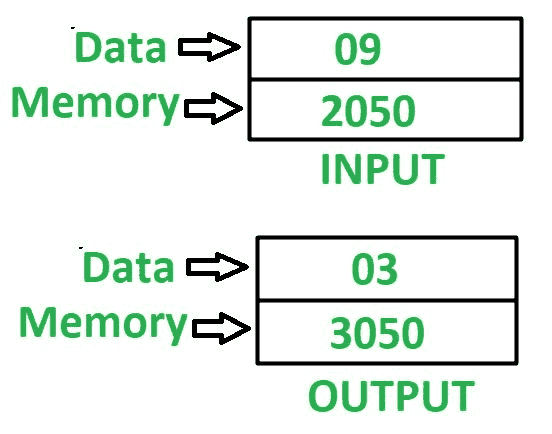

# 8085 程序求一个数的平方根

> 原文:[https://www . geesforgeks . org/8085-program-find-平方根-number/](https://www.geeksforgeeks.org/8085-program-find-square-root-number/)

**问题–**在 8085 微处理器中编写汇编语言程序，求一个数的平方根。

**示例–**

**假设–**
数，我们需要找到它的平方根，存储在内存位置 2050，最终结果存储在内存位置 3050。

**算法–**

1.  将 01 分配给寄存器 D 和 E
2.  加载存储在累加器 A 的存储单元 2050 中的值
3.  从寄存器 D 中减去累加器 A 中存储的值
4.  检查累加器是否保持 0，如果为真，则跳至步骤 8
5.  寄存器 D 的值增加 2
6.  寄存器 E 的值增加 1
7.  跳到第三步
8.  将存储在寄存器 E 中的值移入寄存器 A
9.  将 A 的值存储在存储单元 3050 中

**程序–**

| 内存地址 | 助记符 | comment |
| 2000 | MVI D，01 | D < - 01 |
| 2002 | mvi e.01 | E < - 01 |
| 2004 | LDA 2050 | A<-M【2050】 |
| 2007 | SUB D | A<-A–D |
| 2008 | JZ 2011 | 如果 ZF = 0，跳转到内存位置 2011 |
| 200B | in d | D < - D + 1 |
| 200 摄氏度 | in d | D < - D + 1 |
| 200D | INR E | E < - E + 1 |
| 200E | JMP 2007 | 跳转到内存位置 2007 |
| 2011 | MOV A，E | A < - E |
| 2012 | 他们是 3050 | A->M【3050】 |
| 2015 | HLT | 结束 |

**解释–**使用的寄存器 A、D、E:

1.  **MVI D，01–**用 01 初始化寄存器 D
2.  **MVI E，01–**用 01 初始化寄存器 E
3.  **LDA 2050–**将内存位置 2050 的内容加载到累加器 A 中
4.  **SUB D–**从 A 中减去 D 的值
5.  **如果设置了零标志，则 JZ 2011–**跳转到存储器位置 2011
6.  **INR D–**将寄存器 D 的值增加 1。因为它被使用了两次，所以 D 的值增加了 2
7.  **INR E–**将寄存器 E 的值增加 1
8.  **JMP 2007–**跳转到内存位置 2007
9.  **MOV A，E–**移动累加器 A 中寄存器 E 的值
10.  **STA 3050–**在 3050 中存储 A 的值
11.  **HLT–**停止执行程序并停止任何进一步的执行