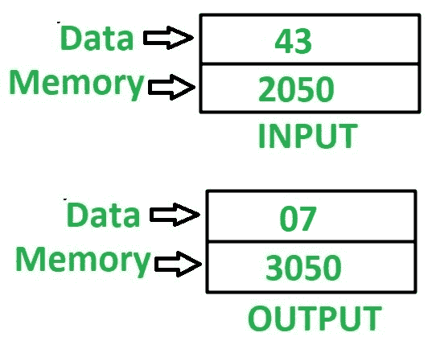

# 8085 程序求 8 位数字的和

> 原文:[https://www . geesforgeks . org/8085-program-find-sum-digits-8 位数字/](https://www.geeksforgeeks.org/8085-program-find-sum-digits-8-bit-number/)

**问题–**在 8085 微处理器中编写汇编语言程序，求一个 8 位数字的位数之和。

**示例–**

**假设–**输入数据和输出数据的地址分别为 2050 和 3050。

**算法–**

1.  加载存储在累加器 A 的存储单元 2050 中的值
2.  移动寄存器 B 中累加器 A 的值
3.  在 **ANI** 指令的帮助下，执行半字节的屏蔽，即执行累加器 A 的**和**操作。我们将在累加器 A 中得到较低的半字节值
4.  移动寄存器 C 中累加器 A 的值
5.  移动累加器 A 中寄存器 B 的值
6.  通过使用 **RLC** 指令 4 次反转存储在累加器 A 中的数字，并按照步骤 3 中的操作再次屏蔽半字节
7.  将累加器 A 中寄存器 C 的值相加
8.  将 A 的值存储在存储单元 3050 中

**程序–**

| 内存地址 | 助记符 | comment |
| 2000 | LDA 2050 | A<-M【2050】 |
| 2003 | MOV B，A | B < - A |
| 2004 | ANI 0F | A < - A(与)0F |
| 2006 | MOV C，A | C < - A |
| 2007 | MOV A，B | A < - B |
| 2008 | RLC | 不进位向左旋转 |
| 2009 | RLC | 不进位向左旋转 |
| 200A | RLC | 不进位向左旋转 |
| 200B | RLC | 不进位向左旋转 |
| 200 摄氏度 | ANI 0F | A < - A(与)0F |
| 200E | 加 C | A < - A + C |
| 200F | 他们是 3050 | M【3050】<-A |
| 2012 | HLT | 结束 |

**解释–**使用的寄存器 A、B、C

1.  **LDA 2050–**将内存位置 2050 的内容加载到累加器 A 中
2.  **MOV B，A–**移动寄存器 B 中累加器 A 的值
3.  **ANI 0F–**在累加器 A 和 0F 的值中执行“与”运算
4.  **MOV C，A–**移动寄存器 C 中累加器 A 的值
5.  **MOV A，B–**移动累加器 A 中寄存器 B 的值
6.  **RLC–**指令将累加器 A 的值旋转 1 位。由于它被执行 4 次，因此这将反转数字，即，用更高阶的半字节交换更低阶的半字节
7.  重复步骤 3
8.  **添加 C–**添加累加器 A 中 C 的寄存器内容
9.  **STA 3050–**在 3050 中存储 A 的值
10.  **HLT–**停止执行程序并停止任何进一步的执行