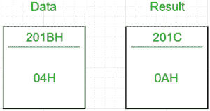
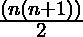

# 8085 程序求前 n 个自然数之和

> 原文:[https://www . geesforgeks . org/8085-program-find-sum-first-n-natural-numbers/](https://www.geeksforgeeks.org/8085-program-find-sum-first-n-natural-numbers/)

**问题–**用 8085 微处理器编写一个计算前 n 个自然数之和的汇编语言程序。

**示例–**

```
Input : 04H
Output : 0AH
as 01+02+03+04 = 10 in decimal => 0AH

```



前 n 个自然数之和的计算公式为。

**算法–**

1.  以 n 为输入，递增得到 n+1。
2.  n 乘以 n+1。
3.  将所得乘积除以 2。

在 8085 微处理器中，不存在直接将两个数相乘的指令，所以乘法是通过重复加法来完成的，因为 4×5 相当于 4+4+4+4+4(即 5 次)。
输入:04H
加 04H 5 次
产品:14H(20 <sub>10</sub>

类似地，在 8085 微处理器中，不存在直接指令来除两个数，所以除法是通过重复减法来完成的。
输入:14H
继续从输入中减去 2，直到减少到 0。
由于 14H 变为 0 之前要做 10 次 <sub>10 次</sub>减法，所以商为 10 <sub>10</sub> = > 0AH。

**步骤–**

1.  将数据从内存位置(201BH，任意选择)加载到累加器中
2.  将此数据移入 B
3.  将累加器中的值增加 1，并将其移动到寄存器 C
4.  用 0 初始化累加器
5.  乘法:不断给累加器加 B。B 必须相加的次数等于 C 的值
6.  用 00H 初始化 B。b 将存储除法的商
7.  用 02H 初始化 C。这是除法的除数
8.  除法:继续从 A 中减去 C，直到 A 变成 0。对于每次减法，将 B 增加 1
9.  最终答案在 b，移到 A，然后把 A 的值存储在 201CH(再次任意选择)

201CH 包含最终答案。

<center>

| 地址 | 标签 | 记忆的 |
| 2000 小时 |  | LDA 201BH |
| 2001H |  |  |
| 2002H |  |  |
| 2003H |  | 莫夫 b，a |
| 2004H |  | INR 到 |
| 2005H |  | 莫夫足球俱乐部 |
| 2006H |  | MVI A， 00H |
| 2007H |  |  |
| 2008H | LOOP1 | 添加 B |
| 2009H |  | DCR C(消歧义) |
| 200AH |  | JNZ 循环 1 |
| 200BH |  |  |
| 200CH |  |  |
| 200DH |  | MVI C， 02H |
| 200EH |  |  |
| 200FH |  | MVI B， 00H |
| 2010H |  |  |
| 2011H | LOOP2 | INR B |
| 2012H |  | 分包合同 |
| 2013H |  | JNZ 循环 2 |
| 2014H |  |  |
| 2015H |  |  |
| 2016H |  | 莫夫 a b |
| 2017H |  | 是 201CH |
| 2018H |  |  |
| 2019H |  |  |
| 201AH |  | HLT |

</center>

将 n 的值存储在 201BH 中。总和可以在 201CH 找到。