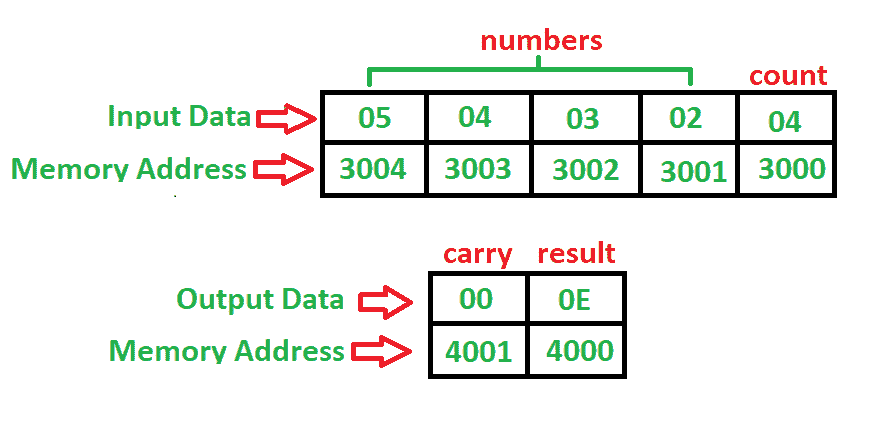

# 8085 程序求一个数列的和

> 原文:[https://www.geeksforgeeks.org/8085-program-find-sum-series/](https://www.geeksforgeeks.org/8085-program-find-sum-series/)

**问题–**写一个程序，求一个数列的和，其中数列从 **3001** 开始，数列的内存地址和计数在 **3000** 内存地址，其中给定程序的起始地址为 **2000** 将结果存入 **4000** 内存地址。

**示例–**

**算法–**

1.  立即将 00 移至寄存器 B 进行进位
2.  立即将内存[3000]的数据加载到 H 中
3.  将内存值移入寄存器 C
4.  将 C 减少 1
5.  将高-低对增加 1
6.  将内存值移入累加器
7.  将高-低对增加 1
8.  使用累加器增加内存的价值
9.  如果没有进位，跳到步骤 11
10.  将寄存器 B 的值增加 1
11.  将寄存器 C 减少 1
12.  如果不是零，跳到步骤 7
13.  将累加器的内容存入存储器[4000] ( **结果**)
14.  将寄存器 B 的内容移入累加器
15.  将累加器的内容存入存储器[4001] ( **携带**)
16.  停止

**程序–**

| 记忆 | 记忆术 | 操作数 | 评论 |
| --- | --- | --- | --- |
| Two thousand | MVI | b，00 | [B] |
| Two thousand and two | LXI | h，[3000] | [高-低] |
| Two thousand and five | MOV | c，M | [C] |
| Two thousand and six | DCR | C | [C] |
| Two thousand and seven | INX | H | [高-低] |
| Two thousand and eight | MOV | 男，女 | [阿] |
| Two thousand and nine | INX | H | [高-低] |
| 200A | 注意缺陷障碍 (Attention Deficit Disorder) | M | [甲] |
| 200B | JNC | 200F | 如果没有进位就跳 |
| 200E | 印度卢比 | B | [乙] |
| 200F | DCR | C | [C] |
| Two thousand and ten | JNZ | Two thousand and nine | 如果不为零，则跳转 |
| Two thousand and thirteen | 无线电台临时使用许可证 | [4000] | 结果 |
| Two thousand and sixteen | MOV | 甲，乙 | [甲] |
| Two thousand and seventeen | 无线电台临时使用许可证 | [4001] | 携带 |
| 201A | HLT |  | 停止 |

**说明–**寄存器 A、B、C、H 用于通用。

1.  **MVI** 用于立即加载 8 位给定寄存器(2 字节指令)
2.  **LXI** 用于使用 16 位地址(3 字节指令)立即加载寄存器对
3.  **MOV** 用于将数据从累加器传输到寄存器(任意)或寄存器(任意)到累加器(1 字节)
4.  **RAR** 用于通过进位(1 字节指令)将‘A’右移
5.  **STA** 用于使用 16 位地址(3 字节指令)将累加器中的数据直接存储到内存中
6.  **INR** 用于给定寄存器增加 1 (1 字节指令)
7.  **JNC** 用于在没有进位(3 字节指令)的情况下跳转到给定步骤
8.  **JNZ** 用于在它们不为零时跳转到给定的步骤(3 字节指令)
9.  **DCR** 用于给定寄存器减 1 (1 字节指令)
10.  **INX** 用于将寄存器对增加 1 (1 字节指令)
11.  **ADD** 用于将累加器的值与给定值相加(1 字节指令)
12.  **HLT** 用于暂停程序