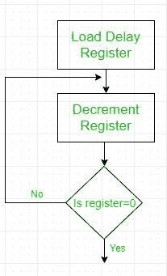

# 8085 程序为十六进制计数器

> 原文:[https://www . geesforgeks . org/8085-十六进制计数器程序/](https://www.geeksforgeeks.org/8085-program-for-hexadecimal-counter/)

编写一个程序，在时钟频率为 0.5 微秒的系统中，从 FFH 到 00H 以十六进制连续计数。使用寄存器 C 在每个输出端口的计数和显示输出之间设置 1 毫秒的延迟。

**问题分析:**

1.  十六进制计数器的设置是通过加载一个带有起始数的寄存器，并递减它直到达到零，然后再递减它到将产生-1，这是 FFH 的二进制补码。因此，登记册再次到达 FFH。
2.  1 毫秒的时间延迟由流程图所示的程序设置-
    
    寄存器加载适当的数字，使得上述循环的执行产生 1 毫秒的时间延迟。

**程序:**

| 地址 | 标签 | 记忆术 |
| --- | --- | --- |
| 2000 小时 |  | MVI B，FFH |
| 2002H | 然后 | DCR B |
| 2003H |  | MVI C， COUNT |
| 2005H | 耽搁 | DCR C(消歧义) |
| 2006H |  | JNZ DELAY |
| 2009H |  | 莫夫 a b |
| 200AH |  | 前哨# |
| 200CH |  | JMP 下一个 |

C 寄存器是时间延迟寄存器，由一个值 COUNT 加载，产生 1 毫秒的时间延迟。
要找到 COUNT 的值，我们需要-

```
TD = TL + TO
where- TD = Time Delay
TL = Time delay inside loop
TO = Time delay outside loop

```

**延迟循环**包括两个指令- DCR C (4 个 T 状态)和 JNZ (10 个 T 状态)
所以 T<sub>L</sub>= 14 *时钟周期*计数
=>14 *(0.5 * 10<sup>-6</sup>)*计数
=>(7 * 10<sup>-6</sup>)*计数

**在**外的延迟该循环包括-
DCR B : 4T
MVI C、COUNT : 7T
MOV A、B : 4T
外转:10T
JMP : 10T
总计:35T

t<sub>O</sub>= 35 *时钟周期= > 17.5 微秒

所以，1 毫秒= (17.5+ 7*COUNT)微秒

**因此，COUNT =(140)<sub>10</sub>T3】**