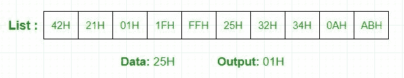

# 8085 线性搜索程序|第 2 集

> 原文:[https://www . geesforgeks . org/8085-线性搜索程序集-2/](https://www.geeksforgeeks.org/8085-program-for-linear-search-set-2/)

**问题–**在 8085 微处理器中编写一个汇编语言程序，在 10 个数字的列表中找到一个给定的数字，如果找到，在输出中存储 1，否则在输出中存储 0。

**示例–**

**假设–**数据在 2040H 找到，2050H 到 2059H 的数字列表，2060H 输出。

**算法–**

1.  加载要在 B 寄存器中搜索的数据字节和 D 寄存器中的计数器。
2.  将起动元件装入蓄能器。
3.  比较累加器和 B 寄存器。
4.  如果设置了零标志，则跳转到点 8(因为当两者相等时，化学机械抛光指令设置零标志)。
5.  减量寄存器
6.  如果 D>0，取累加器中的下一个元素，转到点 3。
7.  如果 D=0，这意味着找不到元素，则存储 00H。结束程序。
8.  存储 01H 作为找到的元素。结束程序。

**程序–**

| 地址 | 标签 | 指令 | 评论 |
| --- | --- | --- | --- |
| 2000 小时 | 数据 | lxi h 2040 小时 | 加载要搜索的数据的地址 |
| 2003H |  | 莫夫 b，m | 将待搜索数据存储在 B 寄存器中 |
| 2004H |  | LXI H，2050H | 加载列表的起始地址 |
| 2007H |  | MVI D，0 啊 | 10 个元素的计数器 |
| 2009H | 然后 | 莫夫 a，m | 在累加器中检索列表元素 |
| 200AH |  | 《议定书》/《公约》缔约方会议 | 将元素与数据字节进行比较 |
| 200BH |  | 够了 | 如果找到数据字节，跳转 |
| 200EH |  | INX H(消歧义) | 列表的下一个元素 |
| 200FH |  | DCR D | 减量计数器 |
| 2010H |  | JNZ NEXT | 如果 D>0，跳到下一步 |
| 2013H |  | lxi h 2060 小时 | 输出的加载地址 |
| 2016H |  | MVI M， 00H | 商店 00H |
| 2018H |  | HLT | 停止 |
| 2019H | 停止 | lxi h 2060 小时 | 输出的加载地址 |
| 201CH |  | MVI M， 01H | 商店 01H |
| 201EH |  | HLT | 停止 |

**解释–**

1.  所有元素逐一与 B 寄存器中的数据字节进行比较
2.  如果找到元素，循环结束并存储 01H
3.  循环执行 10 次
4.  如果在 10 次迭代结束时，没有找到数据字节，则存储 00H

参考 Set-1: [8085 程序，在 n 个数字的数组中搜索一个数字](https://www.geeksforgeeks.org/8085-program-search-number-array-n-numbers/)