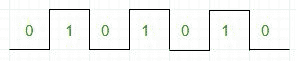

# 8085 脉冲波形程序

> 原文:[https://www . geesforgeks . org/8085-脉冲波形程序/](https://www.geeksforgeeks.org/8085-program-for-pulse-waveform/)

**问题–**编写程序生成连续方波。使用 D <sub>0</sub> 位输出方波。所需波形为:


**解释–**
0/1 位的交替模式可以通过向累加器加载 AAH(10101010)并在每个循环中旋转一次模式来提供。输出端口的位 D <sub>0</sub> 用于证明逻辑 0 和 1。因此，所有其他位都可以通过用 01H 与累加器进行 and 运算来屏蔽。

**示例–**

```
Accumulator   : 1 0 1 0 1 0 1 0
And with 01H  : 0 0 0 0 0 0 0 1
Output        : 0 0 0 0 0 0 0 0
So output => 0

After RLC :

Accumulator   : 0 1 0 1 0 1 0 1 
And with 01H  : 0 0 0 0 0 0 0 1
Output        : 0 0 0 0 0 0 0 1
So output => 1

```

**程序–**

| 地址 | 标签 | 记忆术 | 评论 |
| --- | --- | --- | --- |
| 2000 小时 |  | MVI D，啊 | AAH 加载位模式 |
| 2002H | 辐状的 | 莫夫 a，d | 在 A 中加载位模式 |
| 2003H |  | RLC | 将数据从 AAH 更改为 55H，反之亦然 |
| 2004H |  | 莫夫 d，a | 拯救 A |
| 2005H |  | 安妮 01H | 掩码位 d7 至 <sub>1</sub> |
| 2007H |  | 前哨 1 | 输出 D <sub>0</sub> 位 |
| 2009H |  | JMP 旋转 | 跳转到 ROTATE 以更改逻辑电平 |

**程序描述–**

1.  寄存器 D 加载了 AAH(10101010)。
2.  位模式被移到累加器。
3.  位模式向左旋转，并再次保存在寄存器 d 中。这种保存是必要的，因为累加器在程序中再次使用。
4.  屏蔽除第 0 位以外的所有位。
5.  端口 1 的输出 A。