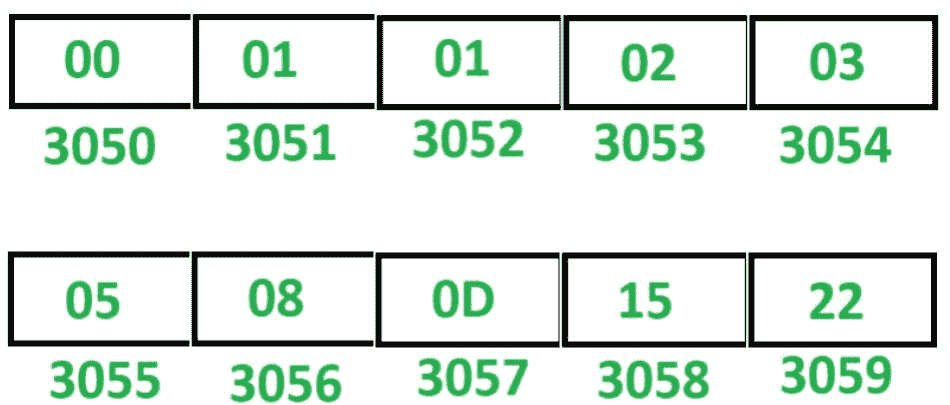

# 8085 程序生成斐波那契数列

> 原文:[https://www . geesforgeks . org/8085-program-generate-Fibonacci-series/](https://www.geeksforgeeks.org/8085-program-generate-fibonacci-series/)

**问题–**在 8085 微处理器中编写汇编语言程序，生成斐波那契数列。

**示例–**假设斐波那契数列存储在起始存储位置 3050。

**注意–**这个程序生成十六进制数的斐波那契数列。

**算法–**

1.  用 30 初始化寄存器 H，用 50 初始化寄存器 L，这样间接存储器 M 指向存储单元 3050。
2.  用 00 初始化寄存器 B，用 08 初始化寄存器 C，用 01 初始化寄存器 D。
3.  在 m 中移动 B 的内容。
4.  将 M 增加 1，使 M 指向下一个存储位置。
5.  在 m 中移动 D 的内容。
6.  移动累加器 a 中的 B 的内容
7.  在 a 中加入 D 的内容。
8.  移动 b 中 D 的内容。
9.  在 d 中移动 A 的内容。
10.  将 M 增加 1，使 M 指向下一个存储位置。
11.  在 m 中移动 A 的内容。
12.  C 减 1。
13.  如果 ZF = 0，跳到存储单元 200，否则暂停程序。

**程序–**

| 存储地址 | 记忆术 | 评论 |
| 2000 | LXI H，3050 | H < - 30，L < - 50 |
| 2003 | MVI C，08 | C < - 08 |
| 2005 | MVI B， 00 | B < - 00 |
| 2007 | MVI D，01 | D < - 01 |
| 2009 | MOV M，B | M < - B |
| 200A | INX H | M < - M + 01 |
| 200B | MOV M，D | M < - D |
| 200 摄氏度 | MOV A，B | A < - B |
| 200D | 加 D | A < - A + D |
| 200E | MOV B，D | B < - D |
| 200F | MOV D，A | D < - A |
| 2010 | INX H | M < - M + 01 |
| 2011 | MOV M，A | M < - A |
| 2012 | DCR C | C<-C–01 |
| 2013 | JNZ 200C | 如果 ZF = 0 则跳转 |
| 2016 | HLT | 结束 |

**说明–**寄存器 A、B、C、D、H、L 用于通用。

1.  **LXI H 3050:** 给 H 分配 30，给 l 分配 50。
2.  **MVI B，00:** 给 B 分配 00
3.  **MVI C，08:** 给 C 分配 08
4.  **MVI D，01:** 给 D 分配 01
5.  **MOV M，B:** 移动 M 中 B 的内容
6.  **INX H:** 将 M 增加 1。
7.  **MOV M，D:** 移动 M 中 D 的内容
8.  **MOV A，B:** 移动 A 中 B 的内容
9.  **添加 D:** 添加 D 和 a 的内容，将结果存入 a。
10.  **MOV B，D:** 移动 B 中 D 的内容
11.  **MOV D，A:** 移动 D 中 A 的内容
12.  **INX H:** 将 M 增加 1。
13.  **MOV M，A:** 移动 M 中 A 的内容
14.  **DCR C:**C 减 1。
15.  **JNZ 200C:** 如果 ZF = 0，跳转到内存位置 200C。
16.  **HLT:** 停止执行程序并停止任何进一步的执行。