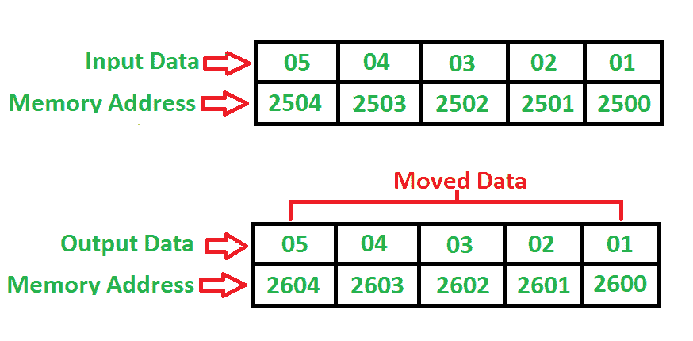

# 8085 将位块从源位置移动到目的位置的程序

> 原文:[https://www . geesforgeks . org/8085-程序-移动-块-位-源-位置-目标-位置/](https://www.geeksforgeeks.org/8085-program-move-blocks-bits-source-location-destination-location/)

**问题**–编写一个程序，将从 **2500** 开始的源位置的位块移动到从 **2600** 开始的目标位置，其中块的大小为 **05** 字节。

**示例–**

**算法–**

1.  用地址 2500H 加载寄存器对 H-L
2.  加载地址为 2600H 的寄存器对 D-E
3.  将内存位置的内容移入累加器
4.  将累加器的内容存储到 D-E 指向的内存中
5.  寄存器对 H-L 和 D-E 的值增加 1
6.  将寄存器 C 的值递减 1
7.  如果零标志不等于 1，请转到步骤 3
8.  停止

**程序–**

| 记忆 | 记忆术 | 操作数 | 评论 |
| --- | --- | --- | --- |
| Two thousand | MVI | c，05 | [C] |
| Two thousand and two | LXI | h，2500 | [高-低] |
| Two thousand and five | LXI | d 2600 |  |
| Two thousand and eight | MOV | 男，女 | [阿] |
| Two thousand and nine | STAX | D | [甲]->[[丁-戊]] |
| 200A | INX | H | [高-低] |
| 200B | INX | D | [D-E] |
| 200 摄氏度 | DCR | C | [C] |
| 200D | JNZ | Two thousand and eight | 从零跳到 2008 年 |
| Two thousand and ten | HLT |  | 停止 |

**说明–**寄存器 A、D、E、H、L、C 用于通用目的:

1.  **MOV** 用于将数据从内存传输到累加器(1 字节)
2.  **LXI** 用于使用 16 位地址(3 字节指令)立即加载寄存器对
3.  **MVI** 用于将数据立即移入任何寄存器(2 字节)
4.  **statx**用于将累加器间接存储到寄存器对中(3 字节指令)
5.  **DCR** 用于将寄存器减少 1 (1 字节指令)
6.  **INX** 用于将寄存器对增加 1 (1 字节指令)
7.  **JNZ** 用于跳转到给定的存储位置(3 字节指令)
8.  **HLT** 用于暂停程序