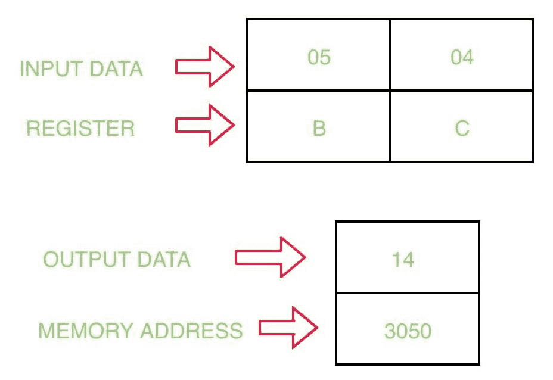

# 8085 使用逻辑指令将两个 8 位数字相乘的程序

> 原文:[https://www . geesforgeks . org/8085-程序-乘-二-8 位数字-使用逻辑指令/](https://www.geeksforgeeks.org/8085-program-multiply-two-8-bit-numbers-using-logical-instructions/)

先决条件–[8085 微处理器中的逻辑指令](https://www.geeksforgeeks.org/logical-instructions-8085-microprocessor/)
**问题–**编写一个汇编语言程序，将两个 8 位数字相乘，并将结果存储在 8085 微处理器中的内存地址 3050。

**示例–**



使用 RLC 指令后累加器(A)的值为:

```
A = 2n*A
```

其中 n =使用 RLC 指令的次数。

**假设–**
假设第一个数字存储在寄存器 B，第二个数字存储在寄存器 c，结果必须没有进位。

**算法–**

1.  将值 05 分配给寄存器 B
2.  将值 04 分配给寄存器 C
3.  在 A 中移动 B 的内容
4.  不带进位向左旋转累加器
5.  不带进位向左旋转累加器
6.  在存储器地址 3050 存储累加器的内容
7.  节目暂停

**程序–**

<center>

| 存储地址 | 记忆术 | 评论 |
| --- | --- | --- |
| Two thousand | MVI B 05 | B |
| Two thousand and two | MVI C 04 | C |
| Two thousand and four | 莫夫 a b | A |
| Two thousand and five | RLC | 不携带旋转 A 的内容 |
| Two thousand and six | RLC | 不携带旋转 A 的内容 |
| Two thousand and seven | STA 3050 | 3050 |
| 200A | HLT | 节目结束 |

</center>

**解释–**

1.  **MVI B 05:** 将值 05 分配给 B 寄存器。
2.  **MVI C 04:** 给 C 04 寄存器赋值。
3.  **MOV A、B:** 将寄存器 B 的内容移到寄存器 A
4.  **RLC:** 旋转累加器中没有进位的内容。
5.  **RLC:** 旋转累加器中没有进位的内容。
6.  **STA 3050:** 将寄存器 A 的内容存储在存储器位置 3050
7.  **HLT:** 停止程序的执行。