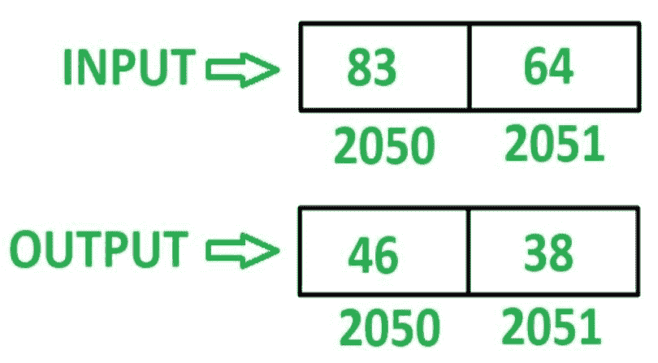

# 8085 程序反转 16 位数字

> 原文:[https://www . geesforgeks . org/8085-program-reverse-16 位数字/](https://www.geeksforgeeks.org/8085-program-reverse-16-bit-number/)

**问题–**在 8085 微处理器中编写汇编语言程序，倒 16 位数字。

**示例–**假设 16 位数字存储在存储器位置 2050 和 2051。

**算法–**

1.  加载寄存器 L 中存储单元 2050 的内容和寄存器 H 中存储单元 2051 的内容
2.  移动累加器 A 中 L 的内容
3.  通过执行 **RLC** 指令 4 次来反转 A 的内容
4.  将 A 的内容移入 L
5.  在 A 中移动 H 的内容
6.  通过执行 **RLC** 指令 4 次来反转 A 的内容
7.  在 H 中移动 L 的内容
8.  将 A 的内容移入 L
9.  在存储单元 2050 中存储 L 的内容，在存储单元 2051 中存储 H 的内容

**程序–**

| 存储地址 | 记忆术 | 评论 |
| 2000 | LHLD 2050 | L<-M【2050】，H<-M【2051】 |
| 2003 | MOV A，L | A < - L |
| 2004 | RLC | 将累加器内容旋转 1 位，不进位 |
| 2005 | RLC | 将累加器内容旋转 1 位，不进位 |
| 2006 | RLC | 将累加器内容旋转 1 位，不进位 |
| 2007 | RLC | 将累加器内容旋转 1 位，不进位 |
| 2008 | MOV L，A | L < - A |
| 2009 | MOV A，H | A < - H |
| 200A | RLC | 将累加器内容旋转 1 位，不进位 |
| 200B | RLC | 将累加器内容旋转 1 位，不进位 |
| 200 摄氏度 | RLC | 将累加器内容旋转 1 位，不进位 |
| 200D | RLC | 将累加器内容旋转 1 位，不进位 |
| 200E | MOV H，L | H < - L |
| 200F | MOV L，A | L < - A |
| 2010 | 【shld 2050】 | M【2050】<-L，M【2051】<-H |
| 2013 | HLT | 结束 |

**说明–**寄存器 A、H、L 用于通用。

1.  **LHLD 2050:** 加载内存位置 2050 在 L，2051 在 h 的内容。
2.  **MOV A，L:** 移动 A 中 L 的含量
3.  **RLC:** 将 A 的内容左移一位，不进位。重复当前指令 4 次，使 A 的内容反转。
4.  **MOV L，A:** 移动 L 中 A 的含量
5.  **MOV A，H:** 移动 A 中 H 的含量
6.  **RLC:** 将 A 的内容左移一位，不进位。重复当前指令 4 次，使 A 的内容反转。
7.  **MOV H，L:** 移动 H 中 L 的含量
8.  **MOV L，A:** 移动 L 中 A 的含量
9.  **SHLD 2050:** 存储 2050 年 L 和 2051 年 H 的含量。
10.  **HLT:** 停止执行程序并停止任何进一步的执行。