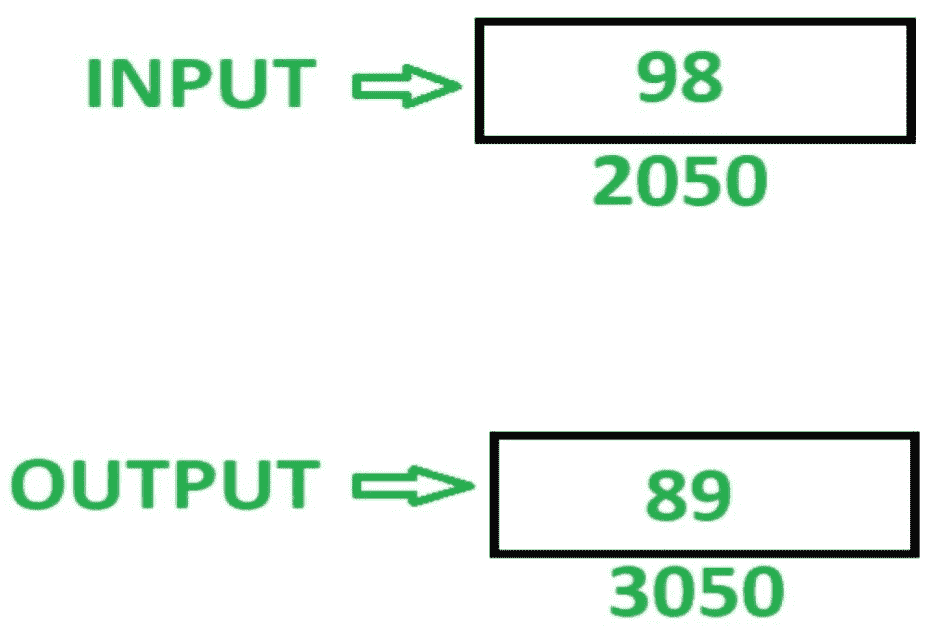

# 8085 程序反转 8 位数字

> 原文:[https://www . geesforgeks . org/8085-program-reverse-8 位数字/](https://www.geeksforgeeks.org/8085-program-reverse-8-bit-number/)

**问题–**在 8085 微处理器中编写汇编语言程序，倒 8 位数字。

**示例–**

假设要反转的数字存储在存储器位置 2050，并且反转的数字存储在存储器位置 3050。

**算法–**

1.  将内存位置 2050 的内容加载到累加器 A 中
2.  使用 **RLC** 指令将 A 的内容移位 1 位，无需进位。使用此指令 4 次，反转 A 的内容
3.  在存储单元 3050 中存储内容 A

**程序–**

T21M【2050】<-A

| 存储地址 | 记忆术 | 评论 |
| 2000 | LDA 2050 | A<-M【2050】 |
| 2003 | RLC | 将累加器的内容向左旋转 1 位 |
| 2004 | RLC | 将累加器的内容向左旋转 1 位 |
| 2005 | RLC | 将累加器的内容左移 1 位 |
| 2006 | RLC | 将累加器的内容左移 1 位 |
| 2007 | T18】STA 3050 |
|  |

**解释–**使用的寄存器 A:

1.  **LDA 2050:** 累加器 a 中内存位置 2050 的加载值
2.  **RLC:** 将累加器的内容向左旋转 1 位
3.  **RLC:** 将累加器的内容向左旋转 1 位
4.  **RLC:** 将累加器的内容向左旋转 1 位
5.  **RLC:** 将累加器的内容向左旋转 1 位
6.  **STA 3050:** 将 A 的内容存储在存储器位置 3050 中。
7.  **HLT:** 停止执行程序并停止任何进一步的执行。