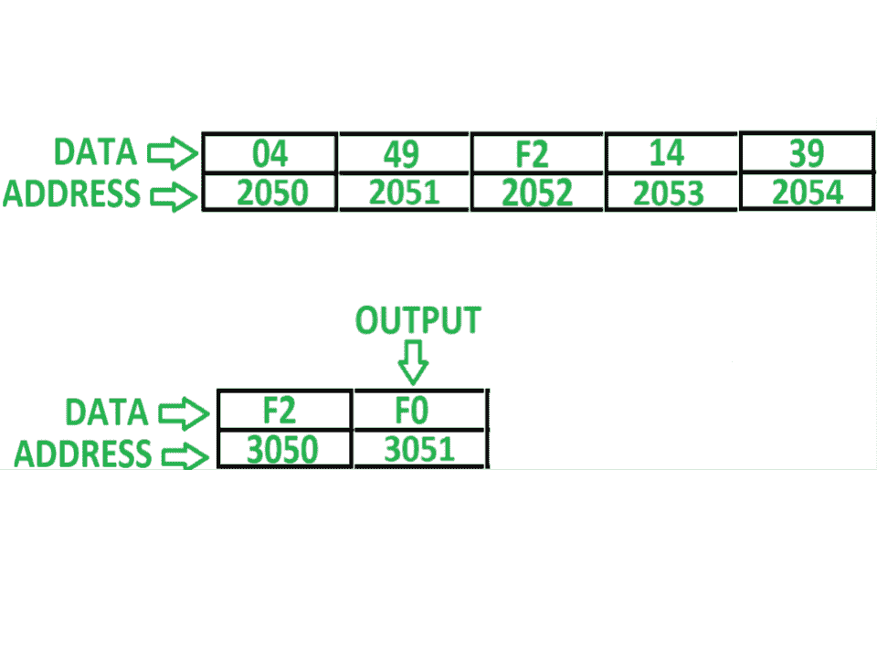
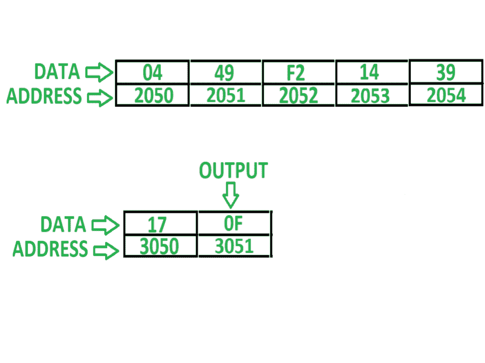

# 8085 程序在 n 个数字的数组中搜索一个数字

> 原文:[https://www . geesforgeks . org/8085-程序-搜索-编号-数组-n-numbers/](https://www.geeksforgeeks.org/8085-program-search-number-array-n-numbers/)

**问题–**用 8085 编写汇编语言程序，在 n 个数字的数组中搜索给定的数字。如果找到号码，则将 F0 存储在存储器位置 3051，否则将 0F 存储在 3051。

**假设–**阵列中的元素计数存储在存储器位置 2050。数组从起始存储器地址 2051 开始存储，用户想要搜索的号码存储在存储器位置 3050。

**示例–**

**算法–**

1.  借助 **LXI H 2050** 指令，使内存指针指向内存位置 2050
2.  将数组大小的值存储在寄存器 C 中
3.  将待搜索号码存储在寄存器 B 中
4.  将内存指针增加 1，使其指向下一个数组索引
5.  将数组元素存储在累加器 A 中，并与 B 的值进行比较
6.  如果两者相同，即如果 ZF = 1，则将 F0 存储在 A 中，并将结果存储在存储单元 3051 中，并转到步骤 9
7.  否则，将 0F 存储在 A 中，并将其存储在存储器位置 3051 中
8.  将 C 递减 01，并检查 C 是否不等于零，即 ZF = 0，如果为真，转到步骤 3，否则转到步骤 9
9.  程序结束

**程序–**

| 内存地址 | 助记符 | comment |
| 2000 | lxi h 2050 | H < - 20，L < - 50 |
| 2003 | MOV C，M | C < - M |
| 2004 | LDA 3050 | A<-M【3050】 |
| 2007 | MOV B，A | B < - A |
| 2008 | INX H | HL < - HL + 0001 |
| 2009 | MOV A，M | A < - M |
| 200A | CMP B | 甲–乙 |
| 200B | JNZ 2014 | 如果 ZF = 0 则跳转 |
| 200E | MVI 至 F0 | A < - F0 |
| 2010 | 他们是 3051 | M【3051】<-A |
| 2013 | HLT | 结束 |
| 2014 | MVI 至 0F | A < - 0F |
| 2016 | 他们是 3051 | M【3051】<-A |
| 2019 | DCR C | C<-C–01 |
| 201A | JNZ 2008 | 如果 ZF = 0 则跳转 |
| 201D | HLT | 结束 |

**解释–**寄存器使用了 A、B、C、H、L 和间接存储器 M:

1.  **LXI H 2050–**用 20 初始化寄存器 H，用 50 初始化寄存器 L
2.  **MOV C，M–**将由寄存器 H 和 L 表示的间接存储单元 M 的内容分配给寄存器 C
3.  **LDA 3050–**将内存位置 3050 的内容加载到累加器 A 中
4.  **MOV B，A–**移动寄存器 B 中 A 的内容
5.  **INX H–**将 HL 增加 1，即 M 增加 1，现在 M 将指向下一个内存位置
6.  **MOV A，M–**移动累加器 A 中内存位置 M 的内容
7.  **CMP B–**从 A 中减去 B，更新标志 8085
8.  **JNZ 2014–**如果重置零标志，即 ZF = 0，则跳转到存储单元 2014
9.  **MVI A0–**将 F0 分配给 A
10.  **STA 3051–**在 3051 中存储 A 的值
11.  **HLT–**停止执行程序并停止任何进一步的执行
12.  **MVI a0f–**将 0F 分配给 A
13.  **STA 3051–**在 3051 中存储 A 的值
14.  **DCR C–**C 递减 01
15.  **JNZ 2008–**如果重置零标志，跳转到存储单元 2008
16.  **HLT–**停止执行程序并停止任何进一步的执行