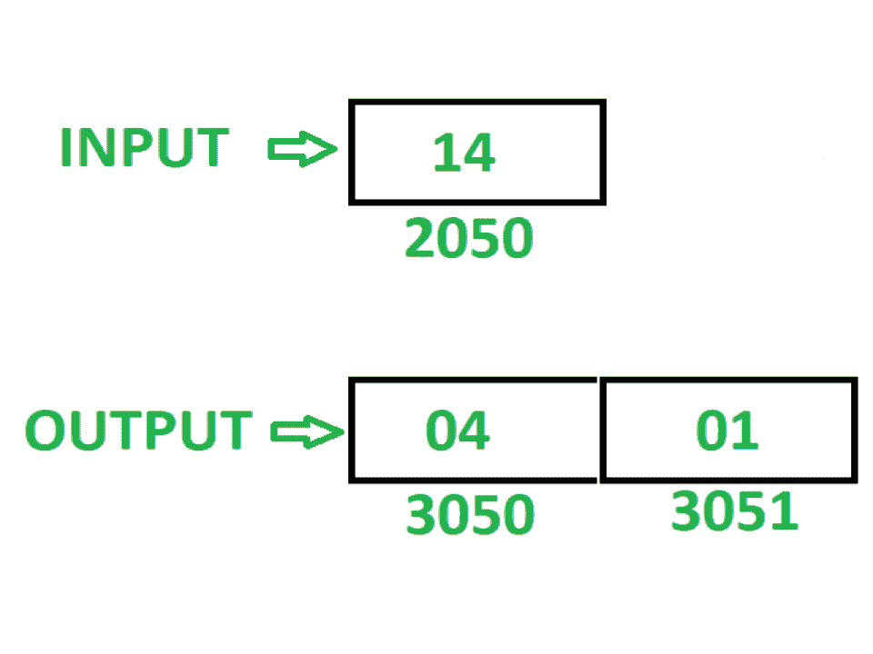

# 8085 程序，显示 8 位数字的较低和较高半字节的屏蔽

> 原文:[https://www . geesforgeks . org/8085-program-show-masking-low-high-半字节-8 位数字/](https://www.geeksforgeeks.org/8085-program-show-masking-lower-higher-nibbles-8-bit-number/)

**问题–**在 8085 微处理器中编写汇编语言程序，显示 8 位数字的低半字节和高半字节的屏蔽。

**示例–**

**假设–**8 位数字存储在存储器位置 2050。在屏蔽半字节后，低位半字节存储在存储单元 3050，高位半字节存储在存储单元 3051。

**算法–**

1.  将内存位置 2050 的内容加载到累加器 a 中
2.  在寄存器 b 中移动 A 的内容。
3.  用 0F 执行“与”运算，并将结果存储在存储单元 3050 中。
4.  在 a 中移动 B 的内容。
5.  用 0F 执行“与”运算，并使用 **RLC** 指令反转结果 4 次。
6.  将结果存储在内存位置 3051。

**程序–**

| 存储地址 | 记忆术 | 评论 |
| 2000 | LDA 2050 | A<-M【2050】 |
| 2003 | MOV B，A | B < - A |
| 2004 | ANI 0F | A < - A(与)0F |
| 2006 | 他们是 3050 | M【3050】<-A |
| 2009 | MOV A，B | A < - B |
| 200A | ANI 0F | A < - A(与)0F |
| 200 摄氏度 | RLC | 将 A 的内容向左旋转 1 位不进位 |
| 200D | RLC | 将 A 的内容向左旋转 1 位不进位 |
| 200E | RLC | 将 A 的内容向左旋转 1 位不进位 |
| 200F | RLC | 将 A 的内容向左旋转 1 位不进位 |
| 2010 | 他们是 3051 | M【3051】<-A |
| 2013 | HLT | 结束 |

**解释–**使用寄存器 A、B:

1.  **LDA 2050:** 将内存位置 2050 的内容加载到累加器 a 中。
2.  **MOV B，A:** 将 A 的内容移动到 B
3.  **ANI 0F:** 用 0F 执行 A 的 AND 运算，并将结果存储回 A
4.  **STA 3050:** 将 A 的内容存储在存储器位置 3050 中。
5.  **MOV A，B:** 移动 A 中 B 的内容
6.  **ANI 0F:** 用 0F 执行 A 的 AND 运算，并将结果存储回 A
7.  **RLC:** 将 A 的内容向左旋转 1 位，不进位。使用此指令 4 次，反转 a 的内容。
8.  **STA 3051:** 将 A 的内容存储在存储单元 3051 中。
9.  **HLT:** 停止执行程序并停止任何进一步的执行。