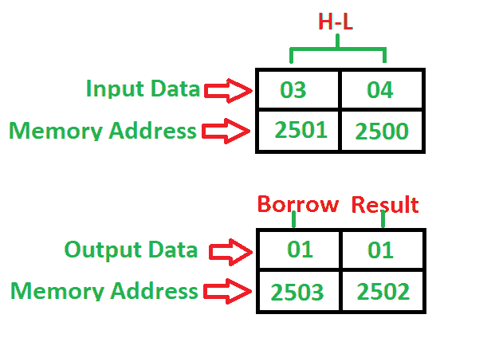

# 8085 程序减去两个 8 位数字有无借用

> 原文:[https://www . geesforgeks . org/8085-program-减法-两个 8 位数字-不带借用/](https://www.geeksforgeeks.org/8085-program-subtract-two-8-bit-numbers-without-borrow/)

**问题**–编写一个程序，在第一个数字位于 **2500** 内存地址，第二个数字位于 **2501** 内存地址的情况下，减去两个 8 位数字，有无借用，并将结果存储到 **2502** 中，借用到 **2503** 内存地址中。

**示例–**

**算法–**

1.  将 00 载入寄存器 C(借用)
2.  将两个 8 位数字从存储器载入寄存器
3.  将一个数字移动到累加器
4.  用累加器减去第二个数字
5.  如果“借”不等于 1，请转到步骤 7
6.  借出寄存器增加 1
7.  将累加器内容存储在内存中
8.  将寄存器内容移入累加器
9.  将累加器的内容存储在其他存储位置
10.  停止

**程序–**

| 记忆 | 记忆术 | 操作数 | 评论 |
| --- | --- | --- | --- |
| Two thousand | MVI | c，00 |  |
| Two thousand and two | 勒瓦尔德 | Two thousand five hundred | [高-低] |
| Two thousand and five | MOV | a，H | [甲] |
| Two thousand and six | 潜水艇 | L | [阿] |
| Two thousand and seven | JNC | 200B | 不借就跳 |
| 200A | 印度卢比 | C | [C] |
| 200B | 无线电台临时使用许可证 | Two thousand five hundred and two | [A] -> [2502]，结果 |
| 200E | MOV | 甲，丙 | [甲] |
| Two thousand and ten | 无线电台临时使用许可证 | Two thousand five hundred and three | [一] -> [2503]，借 |
| Two thousand and thirteen | HLT |  | 停止 |

**说明–**寄存器 A、H、L、C 用于通用目的:

1.  **MOV** 用于将数据从内存传输到累加器(1 字节)
2.  **LHLD** 用于使用 16 位地址(3 字节指令)直接加载寄存器对
3.  **MVI** 用于将数据立即移入任何寄存器(2 字节)
4.  **STA** 用于将累加器的内容存储到内存中(3 字节指令)
5.  **INR** 用于将寄存器增加 1 (1 字节指令)
6.  **JNC** 用于无借用时跳转(3 字节指令)
7.  **SUB** 用于减去两个数字，其中一个数字在累加器中(1 字节)
8.  **HLT** 用于暂停程序

见: [**8086** 程序减去两个 16 位数字有无借用](https://www.geeksforgeeks.org/8086-program-subtract-two-16-bit-numbers-without-borrow/)