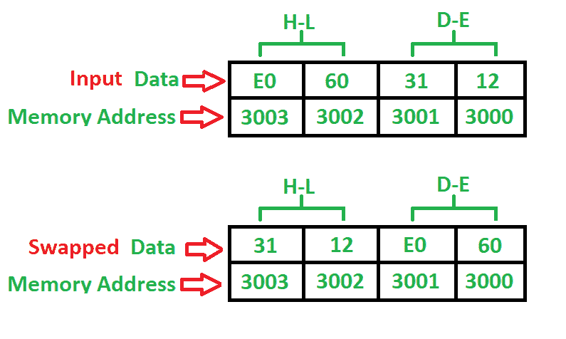

# 8085 使用直接寻址模式交换两个 16 位数字的程序

> 原文:[https://www . geesforgeks . org/8085-程序-交换-两个 16 位数字-使用-直接寻址-模式/](https://www.geeksforgeeks.org/8085-program-swap-two-16-bit-numbers-using-direct-addressing-mode/)

**问题–**编写一个程序，使用直接寻址模式交换两个 16 位数字，其中起始地址为 **2000** ，第一个 16 位数字存储在 **3000** 处，第二个 16 位数字存储在 **3002** 存储地址处。

**示例–**

**算法–**

1.  将 16 位数字从存储器 3000 加载到寄存器对(H-L)中
2.  交换寄存器对
3.  将 16 位数字从存储器 3002 加载到寄存器对中
4.  交换两个寄存器对
5.  停止

**程序–**

| 记忆 | 记忆术 | 操作数 | 评论 |
| --- | --- | --- | --- |
| Two thousand | 勒瓦尔德 | [3000] | [高-低] |
| Two thousand and three | XCHG 表示 |  | [高-低][低-高] |
| Two thousand and four | 勒瓦尔德 | [3002] | [高-低] |
| Two thousand and seven | XCHG 表示 |  | [高-低][低-高] |
| Two thousand and eight | HLT |  | 停止 |

**说明–**寄存器(H-L)对、(D-E)对用于通用目的。

1.  **LHLD** 用于直接使用 16 位地址(3 字节指令)加载寄存器对 H-L
2.  **XCHG** 用于交换两个寄存器对(H-L)、(D-E)的数据(1 字节指令)
3.  **HLT** 用于暂停程序。