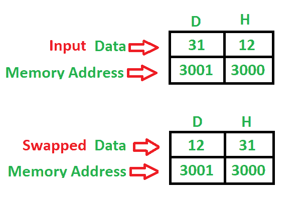

# 8085 程序使用直接寻址模式交换两个 8 位数字

> 原文:[https://www . geesforgeks . org/8085-程序-交换-两个 8 位数字-使用-直接寻址-模式/](https://www.geeksforgeeks.org/8085-program-swap-two-8-bit-numbers-using-direct-addressing-mode/)

**问题–**编写一个程序，使用直接寻址模式交换两个 8 位数字，其中起始地址为 **2000** ，第一个 8 位数字存储在 **3000** 中，第二个 8 位数字存储在 **3001** 存储地址中。

**示例–**

**算法–**

1.  将 8 位数字从存储器 3000 加载到累加器中
2.  将累加器的值移入寄存器 H
3.  将 8 位数字从存储器 3001 加载到累加器中
4.  将累加器的值移入寄存器 D
5.  交换两个寄存器对
6.  停止

**程序–**

| 记忆 | 记忆术 | 操作数 | 评论 |
| --- | --- | --- | --- |
| Two thousand | 皱胃向左移 | [3000] | [一] |
| Two thousand and three | MOV | h，A | [H] |
| Two thousand and four | 皱胃向左移 | [3001] | [一] |
| Two thousand and seven | MOV | 丁，甲 | [丁] |
| Two thousand and eight | XCHG 表示 |  | [高-低][低-高] |
| Two thousand and nine | HLT |  | 停止 |

**说明–**寄存器 A、H、D 用于通用。

1.  **LDA** 使用 16 位地址(3 字节指令)直接加载累加器
2.  **MOV** 用于传输数据(1 字节指令)
3.  **XCHG** 用于交换两个寄存器对(H-L)、(D-E)的数据(1 字节指令)
4.  **HLT** 用于暂停程序。