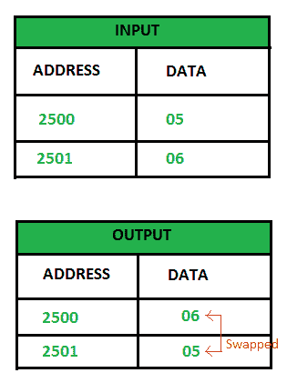

# 8085 程序交换两个 8 位数字

> 原文:[https://www . geesforgeks . org/8085-program-swap-two-8 位数字/](https://www.geeksforgeeks.org/8085-program-swap-two-8-bit-numbers/)

**问题–**编写汇编语言程序，交换 8085 微处理器中存储的两个 8 位数字。

**假设–**假设有两个 8 位数字。一个 8 位数字存储在位置 2500 存储器地址，另一个存储在位置 2501 存储器地址。字母 05 存储在位置 2500，06 存储在位置 2501(不一定，可以是任意两个 8 位数字)。

**示例–**

**算法–**

1.  用任何一个位置(2500 或 2501 或任何给定位置)的内容加载累加器。
2.  将累加器的内容移动到任何寄存器(比如 B)，这样另一个位置的内容就可以加载到累加器中，累加器的前一个数据保存在寄存器中。
3.  将累加器的内容存储到另一个位置(数据为 2501 到 2500)。
4.  用寄存器的内容加载累加器，然后将其存储到另一个地址位置。

**程序–**

| 地址 | 记忆术 | 评论 |
| --- | --- | --- |
| Two thousand | LDA 2500 | 一个 |
| Two thousand and three | 莫夫 b，a | B |
| Two thousand and four | LDA 2501 | 一 |
| Two thousand and seven | STA 2500 | 2500 |
| 200A | 莫夫 a b | A |
| 200B | STA 2501 | 2501 |
| 200E | HLT | 终止程序 |

**解释–**

1.  **LDA 2500–**用位置 2500 的内容加载累加器
2.  **MOV B，A–**将累加器的内容复制到寄存器 B
3.  **LDA 2501–**用位置 2501 的内容加载累加器
4.  **STA 2500–**将累加器的内容存储到位置 2500
5.  **MOV A、B–**将寄存器 B 的内容复制到累加器
6.  **STA 2501–**将累加器的内容存储到位置 2501
7.  **HLT–**终止程序