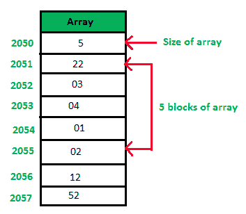
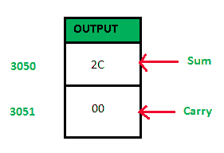

# 8085 程序添加数组中的数字

> 原文:[https://www . geesforgeks . org/8085-数组中的程序添加数字/](https://www.geeksforgeeks.org/8085-program-to-add-numbers-in-an-array/)

**问题–**编写汇编语言程序，将存储在连续内存或数组中的十六进制数相加。

**假设–**假设数组的大小存储在内存位置 2050，数组的基址为 2051。总和将存储在存储器位置 3050，进位将存储在位置 3051。

**示例–**

**算法–**

1.  在 HL 寄存器对中加载数组的基址。
2.  使用数组的大小作为计数器。
3.  将蓄能器初始化为 00。
4.  将累加器的内容与存储在 HL 对中给定存储位置的内容相加。
5.  每次添加时减少计数器。

**程序–**

| 地址 | 记忆术 | 评论 |
| --- | --- | --- |
| Two thousand | LDA 2050 | 一 |
| Two thousand and three | 莫夫 b，a | B |
| Two thousand and four | lxi h 2051 年 | H |
| Two thousand and seven | MVI A， 00 | A |
| Two thousand and nine | MVI C， 00 | C |
| 200B | 添加 M | A |
| 200 摄氏度 | INR L 中 | M |
| 200D | JNC 2011 |  |
| Two thousand and ten | INR C 中 | C |
| Two thousand and eleven | DCR B | B |
| Two thousand and twelve | JNZ 200B |  |
| Two thousand and fifteen | STA 3050 | 3050 |
| Two thousand and eighteen | 莫夫足球俱乐部 | A |
| Two thousand and nineteen | STA 3051 | 3051 |
| 201C | HLT | 终止程序 |

**解释–**

1.  **LDA 2050:** 用位置 2050 的内容加载累加器
2.  **MOV B，A:** 将累加器的内容复制到寄存器 B
3.  **LXI H，2051:** 存储 20 至 H 寄存器和 51 至 L 寄存器
4.  **MVI A，00:** 存储 00 到累加器
5.  **MVI C，00:** 存储 00 注册 C
6.  **添加 M:** 用 HL 寄存器对中给出的存储单元的内容添加累加器
7.  **INR L:** 地址增加 1
8.  **JNC 2011:** 如果没有携带，跳转到位置 2011，否则跳转到 PC 中给定的位置
9.  **INR C:** 寄存器 C 的内容增加 1
10.  **DCR B:** 将寄存器 B 的内容减少 1
11.  **JNZ 200B:** 如果不为零，跳转到位置 200B，否则跳转到 PC 中给定的位置
12.  **STA 3050:** 将累加器的内容存储到存储器位置 3050
13.  **MOV A，C:** 将寄存器 C 的内容复制到累加器
14.  **STA 3051:** 将累加器的内容存储到存储器位置 3051
15.  **HLT:** 终止程序