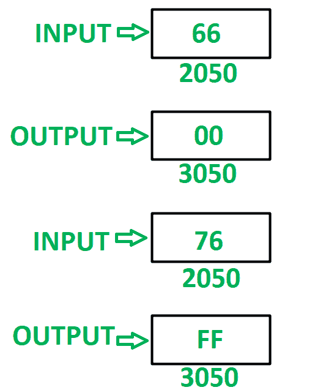

# 8085 程序检查 8 位数字的两个半字节是否相等

> 原文:[https://www . geesforgeks . org/8085-程序检查 8 位数字的两个半字节是否相等/](https://www.geeksforgeeks.org/8085-program-to-check-whether-both-the-nibbles-of-8-bit-number-are-equal-or-not/)

**问题–**在 8085 微处理器中编写汇编语言程序，检查 8 位数字的两个半字节是否相等。如果半字节相等，则在存储单元 3050 中存储 00，否则在存储单元 3050 中存储 FF。

**示例–**

**假设–**检查相似半字节的数字存储在存储器位置 2050。

**算法–**

1.  在 a 中加载内存位置 2050 的内容。
2.  在 b 中移动 A 的内容。
3.  屏蔽下半字节，并将其存储在寄存器 c 中。
4.  在 a 中移动 B 的内容。
5.  屏蔽高阶半字节并将其存储在 a 中。
6.  使用 **RLC** 指令反转 A 的内容 4 次。
7.  借助 **CMP** 指令比较 A 和 C 的内容。更新 8085 的标志。
8.  如果 ZF = 0，现在存储 FF，否则如果 ZF = 1，则存储 00。
9.  将最终结果存储在存储单元 3050 中。

**程序–**

【jmp 201A】【跳转到记忆位置 201 a】

| 存储地址 | 记忆术 | 评论 |
| 2000 | LDA 2050 | A<-M【2050】 |
| 2003 | MOV B，A | B < - A |
| 2004 | ANI 0F | A < - A(与)0F |
| 2006 | MOV C，A | C < - A |
| 2007 | MOV A，B | A < - B |
| 2008 | ANI F0 | A < - A(与)0F |
| 200A | RLC | 将 A 的内容向左旋转一位不进位 |
| 200B | RLC | 将 A 的内容向左旋转一位不进位 |
| 200 摄氏度 | RLC | 将 A 的内容向左旋转一位不进位 |
| 200D | RLC | 将 A 的内容向左旋转一位不进位 |
| 200E | CMP c | A–C |
| 200F | 2018 年 JZ | 如果 ZF = 1 跳跃 |
| 2013 | MVI A，FF | a<-ff |
| 【2015】 |

**说明–**寄存器 A、B、C 用于通用。

1.  **LDA 2050:** 将内存位置 2050 的内容加载到累加器 a 中。
2.  **MOV B，A:** 移动寄存器 B 中 A 的内容
3.  **ANI 0F:** 在 A 和 0F 的内容中执行与运算。将结果存储在 a 中。
4.  **MOV C，A:** 移动寄存器 C 中 A 的内容
5.  **MOV A，B:** 移动 A 中 B 的内容
6.  **ANI F0:** 在 A 和 F0 的内容中进行与运算。将结果存储在 a 中。
7.  **RLC:** 将 A 的内容向左旋转一位，不进位。使用指令 4 次反转数字。
8.  **CMP C:** 比较 A 和 C 的内容，相应更新 8085 的标志。
9.  **如果设置了零标志，则 JZ 2018:** 跳转到存储位置 2018。
10.  **MVI A，FF:** 给 A 分配 FF
11.  **JMP 201A:** 跳转到内存位置 201A。
12.  **MVI A，00:** 给 A 分配 00
13.  **STA 3050:** 将 A 的内容存储在存储单元 3050 中。
14.  **HLT:** 停止执行程序并停止任何进一步的执行。