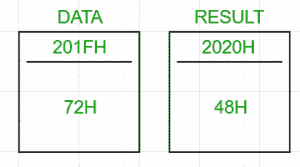

# 8085 程序将一个 BCD 数转换为二进制

> 原文:[https://www . geesforgeks . org/8085-程序-转换-a-BCD-数字-二进制/](https://www.geeksforgeeks.org/8085-program-to-convert-a-bcd-number-to-binary/)

**问题–**用 8085 微处理器编写一个汇编语言程序，将一个 2 位数的 BCD 数转换成它的二进制等价数。

**示例:**

```
Input : 72H (0111 0010)2
Output : 48H (in hexadecimal) (0011 0000)2
((4x16)+(8x1))=72

```



**算法:**

1.  将 BCD 号装入累加器
2.  将 2 位数的 BCD 号码解包为两个独立的数字。让左边的数字为 BCD <sub>1</sub> ，右边的数字为 BCD <sub>2</sub>
3.  将 BCD <sub>1</sub> 乘以 10，再加上 BCD <sub>2</sub>

如果 2 位 BCD 数是 72，那么它的二进制等价物将是
7×OAH+2 = 46H+2 = 48H

**步骤:**

1.  将 BCD 号从存储位置(201FH，任意选择)加载到累加器中
2.  将累加器的值暂时存储在 B 中
3.  通过用 0FH 对累加器求 and 得到 BCD <sub>2</sub> ，并将其存储在 C 中
4.  通过将 B 中的值移动到 a 中来恢复累加器的原始值，并将累加器与 F0H 进行比较
5.  如果累加器中的值等于 0，则 BCD <sub>2</sub> 是最终答案，并将其存储在存储位置 2020H(任意)
6.  否则，向右移动累加器 4 次，获得 BCD <sub>1</sub> 。下一步是将 BCD <sub>1</sub> 乘以 0AH
7.  乘法:将 BCD <sub>1</sub> 移至 D，以 0AH 为计数器初始化 E。将累加器清零，并将 D 加到 E，次数为
8.  最后，在累加器中加入 C，并将结果存储在 2020H 中

2020H 包含结果。

| 地址 | 标签 | 记忆的 |
| 2000 小时 |  | LDA 201FH |
| 2001H |  |  |
| 2002H |  |  |
| 2003H |  | 莫夫 b，a |
| 2004H |  | 0FH 年 |
| 2005H |  |  |
| 2006H |  | 莫夫足球俱乐部 |
| 2007H |  | 莫夫 a b |
| 2008H |  | 阿尼 F0H |
| 2009H |  |  |
| 200AH |  | jz skipmultiply |
| 200BH |  |  |
| 200CH |  |  |
| 200DH |  | （Ladyofthe）RoyalRedCross（英国）皇家护士红十字勋章（获得者） |
| 200EH |  | （Ladyofthe）RoyalRedCross（英国）皇家护士红十字勋章（获得者） |
| 200FH |  | （Ladyofthe）RoyalRedCross（英国）皇家护士红十字勋章（获得者） |
| 2010H |  | （Ladyofthe）RoyalRedCross（英国）皇家护士红十字勋章（获得者） |
| 2011H |  | 莫夫 d，a |
| 2012H |  | xra a |
| 2013H |  | MVI E， 0AH |
| 2014H |  |  |
| 2015H | 总和 | 增加 |
| 2016H |  | DCR 和 |
| 2017H |  | JNZ SUM 公司 |
| 2018H |  |  |
| 2019H |  |  |
| 201AH | SKIPMULTIPLY | 添加 C |
| 2018h |  | 2020H |
| 201CH |  |  |
| 201DH |  |  |
| 201EH |  | HLT |

将 BCD 号存储在 201FH 中。2020H 包含它的二进制等价物。