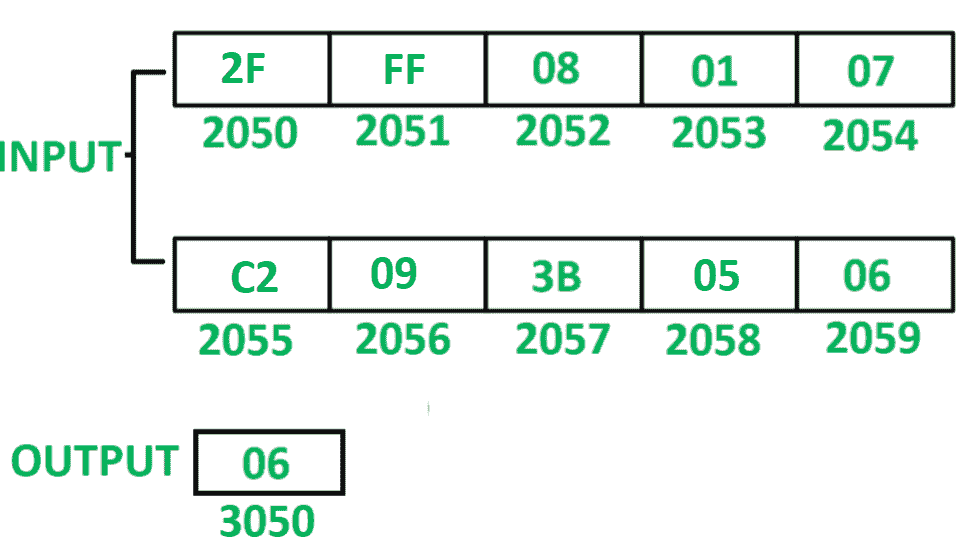

# 8085 编程计数小于 0A 的元素数量

> 原文:[https://www . geeksforgeeks . org/8085-程序-计数-小于 0a 的元素数/](https://www.geeksforgeeks.org/8085-program-to-count-number-of-elements-which-are-less-than-0a/)

**问题–**在 8085 微处理器中编写汇编语言程序，对 10 个数串中小于 0A 的元素个数进行计数。

**示例–**

**假设–**从起始存储位置 2050 开始存储 10 个数字的序列。计数值存储在存储器位置 3050

**算法–**

1.  用 20 初始化寄存器 H，用 4F 初始化寄存器 L，以便间接存储器指向存储单元 204F。
2.  用 00 初始化寄存器 C，用 0A 初始化寄存器 D。
3.  将间接内存增加 01。
4.  移动累加器 a 中 M 的内容
5.  借助 **CPI** 指令对比 A 与 0A 的含量。该指令将更新 8085 的标志。
6.  检查是否设置了进位标志，如果为真，则将 C 的内容增加 01。
7.  D 的内容减少 01。
8.  检查是否重置了零标志，如果是，则跳至步骤 3。
9.  把 C 的内容移到 a。
10.  将 A 的内容存储到内存位置 3050。

**程序–**

| 存储地址 | 记忆术 | 评论 |
| 2000 | lxi h204 f | H < - 20，L < - 4F |
| 2003 | mvi c.00 | C < - 00 |
| 2005 | MVI D，0A | D < - 0A |
| 2007 | INX H | M < - M + 01 |
| 2008 | MOV A，M | A < - M |
| 2009 | CPI 0A | A–0A |
| 200B | JNC 200F | 如果 CY = 0 则跳转 |
| 200E | INR C | C < - C + 01 |
| 200F | DCR d | D<-D–01 |
| 2010 | JNZ 2007 | 如果 ZF = 0 则跳转 |
| 2013 | MOV A，C | A < - C |
| 2014 | 他们是 3050 | M【3050】<-A |
| 2017 | HLT | 结束 |

**说明–**寄存器 A、C、D、H、L 用于通用。

1.  **LXI H 204F:** 给寄存器 H 分配 20，给寄存器 L 分配 4F
2.  **MVI C，00:** 将 00 分配给寄存器 C
3.  **MVI D，0A:** 将 0A 分配给寄存器 D
4.  **INX H:** 将间接存储器位置增加 01
5.  **MOV A，M:** 将间接存储器位置 M 的内容移动到累加器 A
6.  **CPI 0A:** 从 A 的内容中减去 0A，更新标志 8085
7.  **如果 CY = 0，则 JNC 200F:** 跳转到存储器位置 200F
8.  **INR C:**C 含量增加 01
9.  **DCR D:**D 含量减少 01
10.  **JNZ 2007:** 如果 ZF = 0，跳转到内存位置 2007
11.  **MOV A，C:** 将 C 的内容移动到 A
12.  **STA 3050:** 将 A 的内容存储在存储单元 3050 中
13.  **HLT:** 停止执行程序并停止任何进一步的执行